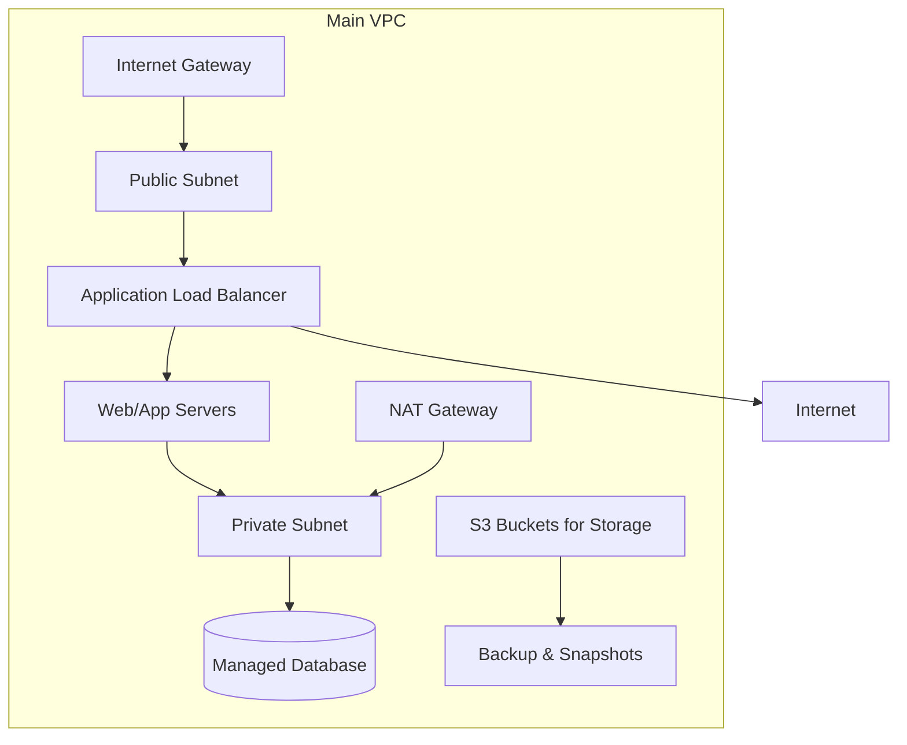

# Cloud Infrastructure Design POC Document

---

## **Authors**

| Author         | Created on | Version | Last updated by | Last Edited On | Level        | Reviewer |
| -------------- | ---------- | ------- | --------------- | -------------- | ------------ | -------- |
| Syed Rehan Ali | 2025-11-21 | 1.0     | Syed Rehan Ali  | 2025-11-21     | Pre Reviewer | Aman     |
| Syed Rehan Ali | 2025-11-21 | 1.1     | Syed Rehan Ali  | 2025-11-21     | L0 Reviewer  | Anjali   |

---

  

Table of Contents

1. [Purpose](#purpose)
2. [Introduction](#introduction)
3. [Prerequisites](#prerequisites)
4. [Cloud Infra Diagram](#cloud-infra-diagram)
5. [Infra Components & Description](#infra-components--description)
6. [Security Groups & NACLs](#security-groups--nacls)
7. [Advantages](#advantages)
8. [Best Practices](#best-practices)
9. [Conclusion](#conclusion)
10. [Contact Information](#contact-information)
11. [References](#references)

---

## Purpose

The purpose of this document is to provide a **comprehensive cloud infrastructure design** for development environments. It explains all resources, their requirements, network setup, security, and best practices to ensure a **scalable, secure, and highly available architecture**.

---

## Introduction

| Topic                           | Description                                                                                                              |
| ------------------------------- | ------------------------------------------------------------------------------------------------------------------------ |
| **Cloud Infrastructure Design** | A high-level plan for deploying applications in the cloud, including network, compute, storage, and security components. |
| **Objectives**                  | Scalability, security, high availability, maintainability, and cost optimization.                                        |
| **Audience**                    | Cloud architects, DevOps engineers, developers, and project stakeholders.                                                |

---

## Prerequisites

| Requirement          | Description                                                          |
| -------------------- | -------------------------------------------------------------------- |
| Cloud Account        | AWS account with admin privileges.                                   |
| Networking Knowledge | Understanding of VPCs, subnets, routing, security groups, and NACLs. |
| Compute Knowledge    | Familiarity with EC2 or similar compute services.                    |
| Database Knowledge   | Understanding RDS or managed database services.                      |
| Security Practices   | IAM, encryption, security group and NACL configurations.             |
| Monitoring & Logging | Familiarity with CloudWatch, CloudTrail, or equivalent.              |

---

## Cloud Infra Diagram

**Diagram Explanation:**

* **Public Subnet:** Hosts ALB and NAT Gateway.
* **Private Subnet:** Hosts EC2 application servers and RDS database.
* **S3 Buckets:** Stores backups, artifacts, and logs.
* **Backup & Snapshots:** Enable disaster recovery.

---

## Infra Components & Description

| Component            | Type/Service     | Description                                                   | Requirement / Size             |
| -------------------- | ---------------- | ------------------------------------------------------------- | ------------------------------ |
| **VPC**              | Network          | Isolated network for all cloud resources.                     | Single VPC for Dev environment |
| **Public Subnet**    | Subnet           | Hosts ALB and NAT Gateway; public-facing.                     | /24 CIDR                       |
| **Private Subnet**   | Subnet           | Hosts application servers and databases; not internet-facing. | /24 CIDR                       |
| **Internet Gateway** | Gateway          | Connects VPC to the internet.                                 | One per VPC                    |
| **NAT Gateway**      | Gateway          | Allows outbound internet for private subnet instances.        | 1 per AZ                       |
| **EC2 Instances**    | Compute          | Hosts application/web servers.                                | t3.medium x2                   |
| **RDS**              | Managed Database | PostgreSQL multi-AZ deployment for HA and backups.            | db.t3.medium                   |
| **S3 Buckets**       | Storage          | Stores logs, artifacts, and backup snapshots.                 | Versioned & encrypted          |
| **ALB**              | Load Balancer    | Distributes incoming traffic to EC2 instances.                | Internet-facing                |
| **CloudWatch**       | Monitoring       | Monitors infrastructure metrics, logs, and triggers alerts.   | Enabled for all resources      |
| **IAM Roles**        | Security         | Assign least privilege access to EC2, RDS, and S3.            | Custom roles per service       |

---

## Security Groups & NACLs

| Resource        | Security Group Rules                                        | NACL Rules                                         |
| --------------- | ----------------------------------------------------------- | -------------------------------------------------- |
| **ALB**         | Inbound 80/443, Outbound all                                | Allow inbound/outbound to public subnet only       |
| **EC2 Web/App** | Inbound 80/443 from ALB, SSH from admin IP only             | Deny all public inbound except ALB, allow outbound |
| **RDS**         | Inbound 5432 from private subnet only                       | Deny public inbound, allow private subnet traffic  |
| **S3 Buckets**  | Bucket policies allow read/write from EC2 or IAM roles only | N/A                                                |
| **NAT Gateway** | Outbound internet access for private subnet only            | Restrict inbound traffic to NAT IPs                |

---

## Advantages

| Advantage         | Description                                                            |
| ----------------- | ---------------------------------------------------------------------- |
| Scalability       | Auto-scaling of EC2, multi-AZ RDS, and S3 storage ensures growth.      |
| Security          | Segmented subnets, security groups, NACLs, and IAM roles reduce risk.  |
| High Availability | Load balancer + multi-AZ deployments reduce downtime.                  |
| Observability     | CloudWatch monitoring and logging for proactive maintenance.           |
| Backup & Recovery | S3 and RDS snapshots enable DR and quick MTTR.                         |
| Cost Optimization | Use of on-demand/reserved instances and auto-scaling to control costs. |

---

## Best Practices

| Best Practice                         | Description                                                   |
| ------------------------------------- | ------------------------------------------------------------- |
| Separate Dev, Test, Prod Environments | Ensures isolation and safe testing.                           |
| Use Least Privilege IAM Roles         | Minimize security risks.                                      |
| Enable Logging & Monitoring           | CloudWatch, CloudTrail, and alarms for proactive maintenance. |
| Multi-AZ & Multi-Region Deployments   | Reduces downtime and MTTR.                                    |
| Encrypt Data in Transit & at Rest     | Use KMS for S3 and RDS encryption.                            |
| Regular DR Drills                     | Test backup & restore procedures to ensure readiness.         |

---

## Conclusion

This **Cloud Infrastructure Design** provides a **robust, secure, and highly available environment**:

* Multi-tier VPC with public/private subnets.
* High availability using ALB, multi-AZ RDS, and NAT Gateway.
* Security through SGs, NACLs, IAM roles, and encryption.
* Observability and backup mechanisms reduce MTTR.
* Production-ready, scalable, and cost-optimized for Dev/QA workloads.

---

## Contact Information

| Name           | Email                                                                                   |
| -------------- | --------------------------------------------------------------------------------------- |
| Syed Rehan Ali | [syed.rehan.ali.snaatak@mygurukulum.com](mailto:syed.rehan.ali.snaatak@mygurukulum.com) |

---

## References

| No | Reference                                                             |
| -- | --------------------------------------------------------------------- |
| 1  | [AWS Cloud Architecture Center](https://aws.amazon.com/architecture/) |
| 2  | [AWS VPC Documentation](https://docs.aws.amazon.com/vpc/)             |
| 3  | [AWS EC2 Documentation](https://docs.aws.amazon.com/ec2/)             |
| 4  | [AWS RDS Documentation](https://docs.aws.amazon.com/rds/)             |
| 5  | [AWS S3 Documentation](https://docs.aws.amazon.com/s3/)               |
| 6  | [AWS Security Best Practices](https://aws.amazon.com/security/)       |
