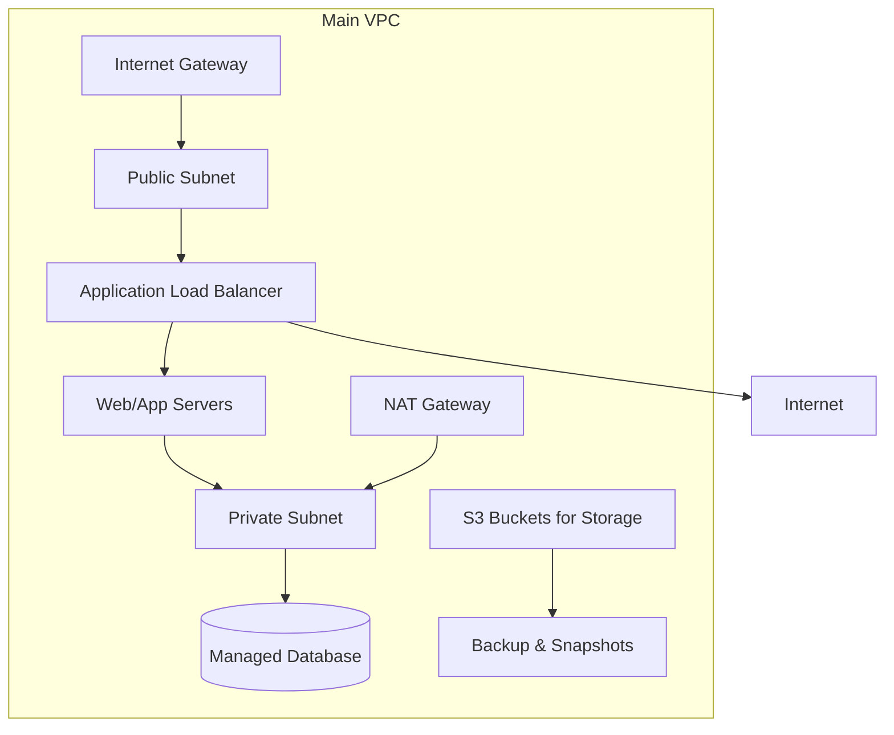
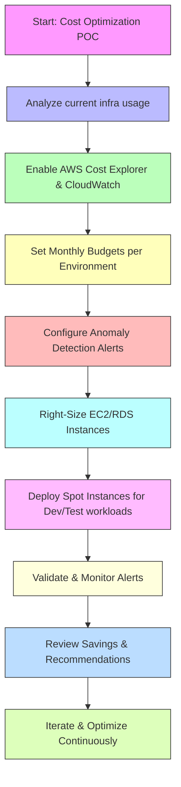

# Cloud Infrastructure & Cost Optimization POC

---

## **Authors**

| Author         | Created on | Version | Last updated by | Last Edited On | Level        | Reviewer |
| -------------- | ---------- | ------- | --------------- | -------------- | ------------ | -------- |
| Syed Rehan Ali | 2025-11-21 | 1.0     | Syed Rehan Ali  | 2025-11-21     | Pre Reviewer | Aman     |
| Syed Rehan Ali | 2025-11-21 | 1.1     | Syed Rehan Ali  | 2025-11-21     | L0 Reviewer  | Anjali   |

---

  

Table of Contents

1. [Purpose](#purpose)
2. [Introduction](#introduction)
3. [Prerequisites](#prerequisites)
4. [Cloud Infra Diagram](#cloud-infra-diagram)
5. [Infra Components & Description](#infra-components--description)
6. [Security Groups & NACLs](#security-groups--nacls)
7. [Cost Optimization Workflow](#cost-optimization-workflow)
8. [Right-Sizing & Spot Instances](#right-sizing--spot-instances)
9. [Advantages](#advantages)
10. [Best Practices](#best-practices)
11. [Demo / POC Instructions](#demo--poc-instructions)
12. [Conclusion & Recommendation](#conclusion--recommendation)
13. [Contact Information](#contact-information)
14. [References](#references)

---

## Purpose

Provide a **comprehensive Cloud Infrastructure Design** combined with **Cost Optimization & Budget/Alert POC**, covering **architecture, resource requirements, security, cost saving, monitoring, best practices, and recommendations**.

---

## Introduction

| Topic                    | Description                                                                                            |
| ------------------------ | ------------------------------------------------------------------------------------------------------ |
| **Cloud Infrastructure** | High-level design for deploying applications in cloud with networking, compute, storage, and security. |
| **Cost Optimization**    | Monitor, manage, and reduce cloud costs while maintaining performance.                                 |
| **Audience**             | Cloud architects, DevOps engineers, finance teams, developers, and stakeholders.                       |

---

## Prerequisites

| Requirement          | Description                                          |
| -------------------- | ---------------------------------------------------- |
| AWS Account          | Admin privileges with billing and monitoring access. |
| Networking Knowledge | VPCs, subnets, routing, SGs, NACLs.                  |
| Compute Knowledge    | EC2, RDS, load balancers.                            |
| Security Knowledge   | IAM, encryption, security groups, NACLs.             |
| Monitoring Tools     | CloudWatch, CloudTrail, Cost Explorer.               |

---

## Cloud Infra Diagram

---

## Infra Components & Description

| Component            | Type/Service     | Description                                                   | Requirement / Size             |
| -------------------- | ---------------- | ------------------------------------------------------------- | ------------------------------ |
| **VPC**              | Network          | Isolated network for all cloud resources.                     | Single VPC for Dev environment |
| **Public Subnet**    | Subnet           | Hosts ALB and NAT Gateway; public-facing.                     | /24 CIDR                       |
| **Private Subnet**   | Subnet           | Hosts application servers and databases; not internet-facing. | /24 CIDR                       |
| **Internet Gateway** | Gateway          | Connects VPC to the internet.                                 | One per VPC                    |
| **NAT Gateway**      | Gateway          | Allows outbound internet for private subnet instances.        | 1 per AZ                       |
| **EC2 Instances**    | Compute          | Hosts application/web servers.                                | t3.medium x2                   |
| **RDS**              | Managed Database | PostgreSQL multi-AZ deployment for HA and backups.            | db.t3.medium                   |
| **S3 Buckets**       | Storage          | Stores logs, artifacts, and backup snapshots.                 | Versioned & encrypted          |
| **ALB**              | Load Balancer    | Distributes incoming traffic to EC2 instances.                | Internet-facing                |
| **CloudWatch**       | Monitoring       | Monitors infrastructure metrics, logs, and triggers alerts.   | Enabled for all resources      |
| **IAM Roles**        | Security         | Assign least privilege access to EC2, RDS, and S3.            | Custom roles per service       |

---

## Security Groups & NACLs

| Resource        | Security Group Rules                                        | NACL Rules                                         |
| --------------- | ----------------------------------------------------------- | -------------------------------------------------- |
| **ALB**         | Inbound 80/443, Outbound all                                | Allow inbound/outbound to public subnet only       |
| **EC2 Web/App** | Inbound 80/443 from ALB, SSH from admin IP only             | Deny all public inbound except ALB, allow outbound |
| **RDS**         | Inbound 5432 from private subnet only                       | Deny public inbound, allow private subnet traffic  |
| **S3 Buckets**  | Bucket policies allow read/write from EC2 or IAM roles only | N/A                                                |
| **NAT Gateway** | Outbound internet access for private subnet only            | Restrict inbound traffic to NAT IPs                |

---

## Cost Optimization Workflow

---

## Right-Sizing & Spot Instances

| Action                        | Description                                                                         |
| ----------------------------- | ----------------------------------------------------------------------------------- |
| **Right-Sizing**              | Resize EC2, RDS, and other compute resources to match actual usage to reduce waste. |
| **Spot Instances**            | Use for non-critical workloads (dev/test) to save up to 90% of EC2 costs.           |
| **Instance Scheduling**       | Start/stop dev/test instances automatically during off-hours to reduce cost.        |
| **Tagging & Cost Allocation** | Tag resources to identify owners and optimize budgets.                              |

---

## Advantages

| Advantage             | Description                                                           |
| --------------------- | --------------------------------------------------------------------- |
| Scalability           | Auto-scaling of EC2, multi-AZ RDS, and S3 storage ensures growth.     |
| Cost Savings          | Right-sizing and spot instances reduce overall cloud spend.           |
| Security              | Segmented subnets, security groups, NACLs, IAM roles, and encryption. |
| Observability         | CloudWatch monitoring and logging for proactive maintenance.          |
| Backup & Recovery     | S3 and RDS snapshots enable DR and quick MTTR.                        |
| Proactive Alerts      | Detect anomalies before they impact budget.                           |
| Flexible Optimization | Spot instances, scheduling, and tagging allow dynamic cost reduction. |

---

## Best Practices

| Best Practice                         | Description                                                   |
| ------------------------------------- | ------------------------------------------------------------- |
| Separate Dev, Test, Prod Environments | Ensures isolation and safe testing.                           |
| Use Least Privilege IAM Roles         | Minimize security risks.                                      |
| Enable Logging & Monitoring           | CloudWatch, CloudTrail, and alarms for proactive maintenance. |
| Multi-AZ & Multi-Region Deployments   | Reduces downtime and MTTR.                                    |
| Encrypt Data in Transit & at Rest     | Use KMS for S3 and RDS encryption.                            |
| Regular DR Drills                     | Test backup & restore procedures to ensure readiness.         |
| Use Spot Instances Strategically      | Only for workloads that tolerate interruptions.               |
| Automate Cost Alerts                  | Configure SNS/email notifications for anomalies.              |
| Right-Size Resources                  | Continuously monitor and adjust instance types/sizes.         |

---

## Demo / POC Instructions

1. Enable AWS Cost Explorer & CloudWatch for all accounts in the previous infra POC.
2. Create Monthly Budgets per environment (Dev, Test, Prod).
3. Configure Anomaly Detection Alerts via SNS/email.
4. Right-size EC2/RDS instances using CloudWatch metrics.
5. Launch dev/test workloads on Spot Instances and verify savings.
6. Test alerts by simulating usage spikes.
7. Document savings, optimization, and lessons learned.

---

## Conclusion & Recommendation

* This POC provides a **complete cloud infra + cost optimization design**.
* **Recommended Tools:** AWS Cost Explorer, Budgets, CloudWatch, Trusted Advisor.
* Continuous monitoring and optimization cycles are essential to maintain **cost efficiency, scalability, and high availability**.

---

## Contact Information

| Name           | Email                                                                                   |
| -------------- | --------------------------------------------------------------------------------------- |
| Syed Rehan Ali | [syed.rehan.ali.snaatak@mygurukulum.com](mailto:syed.rehan.ali.snaatak@mygurukulum.com) |

---

## References

| No | Reference                                                                                                             |
| -- | --------------------------------------------------------------------------------------------------------------------- |
| 1  | [AWS Cloud Architecture Center](https://aws.amazon.com/architecture/)                                                 |
| 2  | [AWS Cost Optimization Best Practices](https://aws.amazon.com/aws-cost-management/)                                   |
| 3  | [AWS Budgets Documentation](https://docs.aws.amazon.com/awsaccountbilling/latest/aboutv2/budgets-managing-costs.html) |
| 4  | [AWS Trusted Advisor](https://aws.amazon.com/premiumsupport/trustedadvisor/)                                          |
| 5  | [Spot Instance Guide](https://docs.aws.amazon.com/AWSEC2/latest/UserGuide/using-spot-instances.html)                  |
| 6  | [Right-Sizing EC2 Instances](https://docs.aws.amazon.com/autoscaling/ec2/userguide/asg-instance-type.html)            |

