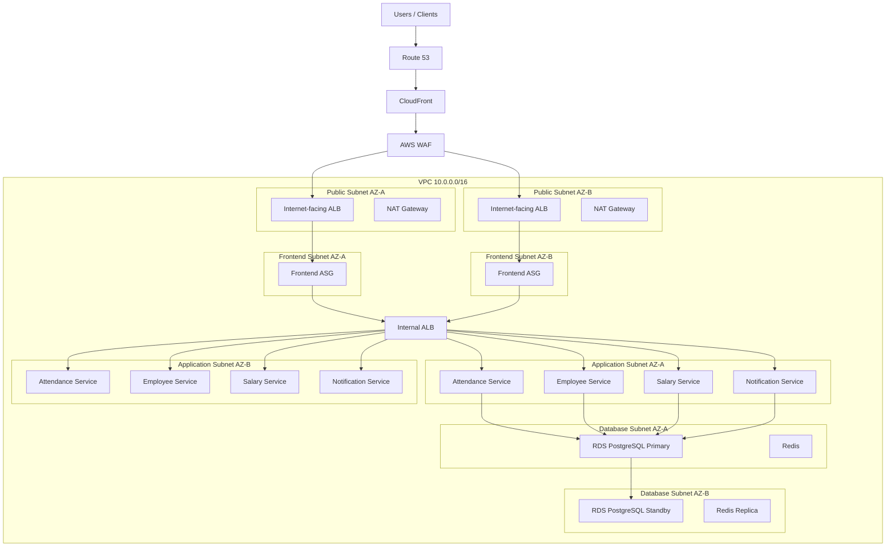

```mermaid
flowchart TB
    %% USERS & DNS
    User[Users / Clients]
    Route53[Route 53]
    CloudFront[CloudFront]
    WAF[AWS WAF]

    %% EDGE
    User --> Route53 --> CloudFront --> WAF

    %% VPC
    subgraph VPC["VPC 10.0.0.0/16"]
        direction TB

        %% PUBLIC SUBNETS
        subgraph PublicAZA["Public Subnet AZ-A"]
            ALB_Public_A[Internet-facing ALB]
            NAT_A[NAT Gateway]
        end

        subgraph PublicAZB["Public Subnet AZ-B"]
            ALB_Public_B[Internet-facing ALB]
            NAT_B[NAT Gateway]
        end

        %% FRONTEND TIER
        subgraph FrontendAZA["Frontend Subnet AZ-A"]
            FE_A[Frontend ASG]
        end

        subgraph FrontendAZB["Frontend Subnet AZ-B"]
            FE_B[Frontend ASG]
        end

        %% INTERNAL LOAD BALANCER
        InternalALB[Internal ALB]

        %% APPLICATION TIER
        subgraph AppAZA["Application Subnet AZ-A"]
            Attendance_A[Attendance Service]
            Employee_A[Employee Service]
            Salary_A[Salary Service]
            Notification_A[Notification Service]
        end

        subgraph AppAZB["Application Subnet AZ-B"]
            Attendance_B[Attendance Service]
            Employee_B[Employee Service]
            Salary_B[Salary Service]
            Notification_B[Notification Service]
        end

        %% DATABASE TIER
        subgraph DBAZA["Database Subnet AZ-A"]
            RDS_Primary[RDS PostgreSQL Primary]
            Redis_A[Redis]
        end

        subgraph DBAZB["Database Subnet AZ-B"]
            RDS_Standby[RDS PostgreSQL Standby]
            Redis_B[Redis Replica]
        end
    end

    %% TRAFFIC FLOW
    WAF --> ALB_Public_A
    WAF --> ALB_Public_B

    ALB_Public_A --> FE_A
    ALB_Public_B --> FE_B

    FE_A --> InternalALB
    FE_B --> InternalALB

    InternalALB --> Attendance_A
    InternalALB --> Attendance_B
    InternalALB --> Employee_A
    InternalALB --> Employee_B
    InternalALB --> Salary_A
    InternalALB --> Salary_B
    InternalALB --> Notification_A
    InternalALB --> Notification_B

    Attendance_A --> RDS_Primary
    Employee_A --> RDS_Primary
    Salary_A --> RDS_Primary
    Notification_A --> RDS_Primary

    RDS_Primary --> RDS_Standby
```
