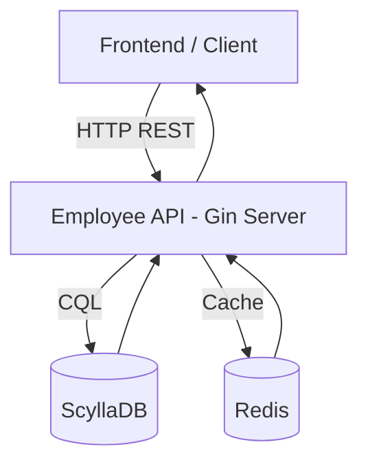

# **Employee API | Backend Service Setup & Deployment Documentation**

<p align="center">
  
</p>

## **Authors**

| Author         | Created On | Version | Last Updated By | Last Edited On | Reviewer |
| -------------- | ---------- | ------- | --------------- | -------------- | -------- |
| Syed Rehan Ali | 19-12-2025 | 1.0     | Syed Rehan Ali  | 20-12-2025     | —        |

<details>
<summary><h2><strong>Table of Contents</strong></h2></summary>

* [Introduction](#introduction)
* [Purpose of This Document](#purpose-of-this-document)
* [System Architecture](#system-architecture)
* [Tools & Technologies](#tools--technologies)
* [Database Architecture](#database-architecture)
* [Project Structure Explained](#project-structure-explained)
* [Configuration Management](#configuration-management)
* [Step-by-Step Setup Guide](#step-by-step-setup-guide)
* [Build & Dependency Management Notes](#build--dependency-management-notes)
* [Running Employee API (Actual Mode)](#running-employee-api-actual-mode)
* [API Exposure & Networking](#api-exposure--networking)
* [Database Safety & Isolation](#database-safety--isolation)
* [Operational Commands](#operational-commands)
* [Troubleshooting](#troubleshooting)
* [Best Practices](#best-practices)
* [Systemd Service File](#systemd-service-file)
* [Reference Links](#reference-links)
* [Conclusion](#conclusion)

</details>


## **Introduction**

The **Employee API** is a production-ready backend service written in **Go (Golang)** using the **Gin framework**, designed to expose employee-related business APIs backed by a **distributed NoSQL database (ScyllaDB / Cassandra)** and optionally **Redis** for caching.

This document describes the **ACTUAL setup**, where:

* The API is connected to a **real database**
* The service runs on a **server IP**
* Other teams (Frontend / Database) can safely integrate
* No mock or dummy layers are involved


## **Purpose of This Document**

This document ensures:

* Clear understanding of **how the API works**
* Safe integration with **real databases**
* Confidence for **DB and frontend teams**
* Repeatable deployment across environments (DEV / QA / UAT)

## **System Architecture**



**Explanation:**

* **Frontend / Client** – Sends HTTP requests to API
* **Employee API (Gin Server)** – Handles routing, business logic, DB/cache access
* **ScyllaDB** – Persistent employee data storage
* **Redis** – Optional caching layer for fast access (search, lookup, etc.)


## **Tools & Technologies**

For running the application, we need following things configured:

| Tool                 | Purpose                   |
| -------------------- | ------------------------- |
| Go (1.20+)           | Backend language          |
| Gin                  | HTTP routing & middleware |
| Viper                | Configuration management  |
| ScyllaDB / Cassandra | Distributed NoSQL DB      |
| Redis                | Caching layer             |
| systemd              | Service management        |
| Linux (Ubuntu)       | Hosting OS                |

[ScyllaDB](https://www.scylladb.com/)

[Redis](https://github.com/redis.com/)

---

## **Database Architecture**

### **Why ScyllaDB / Cassandra**

| Feature            | Benefit                        |
| ------------------ | ------------------------------ |
| Distributed        | No single point of failure     |
| High throughput    | Handles large read/write loads |
| Horizontal scaling | Easy node expansion            |
| CQL support        | SQL-like querying              |

### **Database Communication Flow**

1. API receives HTTP request
2. API validates input
3. API queries **Redis cache** first (if configured)
4. If cache miss, API executes **CQL query** on ScyllaDB
5. DB responds and API optionally caches response in Redis
6. API returns JSON response

---

## **Project Structure Explained**

```text
employee-api/
├── api/
│   ├── api.go          # Employee CRUD logic (DB connected)
│   ├── health.go       # Health endpoints
│
├── config/
│   ├── viper.go        # Reads config.yaml
│
├── model/
│   ├── employee.go     # Data models
│
├── routes/
│   ├── routes.go       # API routing
│
├── middleware/
│   ├── logging.go      # Request logging
│
├── migration/
│   ├── *.cql           # DB schema files
│
├── main.go             # Application entrypoint
├── config.yaml         # Environment config
└── go.mod
```

---

## **Configuration Management**

### **config.yaml**

```yaml
server:
  port: 8082

database:
  host: 127.0.0.1
  port: 9042
  keyspace: employee_ks
  username: cassandra
  password: cassandra

redis:
  host: 127.0.0.1
  port: 6379
```

### **How Viper Works**

| Step          | Description            |
| ------------- | ---------------------- |
| Load file     | Reads config.yaml      |
| Map values    | Converts to Go structs |
| Inject config | Used by DB & server    |

---

## **Step-by-Step Setup Guide**

### **Step 0: Update System (Recommended)**

```bash
sudo apt-get update -y
sudo apt-get upgrade -y
```

---

### **Step 1: Install Go**

```bash
sudo apt install golang -y
go version
```

---

### **Step 2: Install ScyllaDB / Cassandra**

**Only ONE DB is required, not both**

#### **Option A: Cassandra**

```bash
sudo apt install cassandra -y
sudo systemctl enable cassandra
sudo systemctl start cassandra
```

#### **Option B: ScyllaDB**

```bash
sudo apt install scylla -y
sudo scylla_setup
```

---

### **Step 3: Create Keyspace**

```sql
CREATE KEYSPACE employee_ks
WITH replication = {
  'class': 'SimpleStrategy',
  'replication_factor': 1
};
```

---

### **Step 4: Run Migrations**

```bash
cqlsh -f migration/001_employee_table.cql
```

---

## **Build & Dependency Management Notes**

### **Handling Dependencies**

```bash
go mod tidy
go mod download -x
```

> `go mod tidy` ensures all required dependencies are present and cleans unused modules.
> `-x` prints debug info for slow downloads or compilation.

### **Building the API**

```bash
go clean
go install -v ./...
go build -v -o employee-api main.go
```

---

## **Running Employee API (Actual Mode)**

```bash
export GIN_MODE=release
./employee-api
```

### **Verify API is Running**

```bash
curl http://localhost:8082/api/v1/employee/health
```

Expected:

```
Listening on :8082
Connected to ScyllaDB
```

---

## **API Endpoints**

| HTTP Method | Endpoint                              | Description                                | Notes                                  |
| ----------- | ------------------------------------- | ------------------------------------------ | -------------------------------------- |
| GET         | `/api/v1/employee/health`             | Basic health check of the API              | Returns status OK                      |
| GET         | `/api/v1/employee/health/detail`      | Detailed health check including DB & cache | Returns JSON status of DB and Redis    |
| POST        | `/api/v1/employee/create`             | Create a new employee record               | Accepts JSON payload                   |
| GET         | `/api/v1/employee/search`             | Search employee by general parameters      | Query params supported                 |
| GET         | `/api/v1/employee/search/all`         | Get all employee records                   | Returns array of employees             |
| GET         | `/api/v1/employee/search/location`    | Filter employees by location               | Query param: `location=<city>`         |
| GET         | `/api/v1/employee/search/designation` | Filter employees by designation            | Query param: `designation=<role>`      |
| GET         | `/api/v1/employee/search/status`      | Filter employees by employment status      | Query param: `status=active`           |
| GET         | `/api/v1/employee/search/roles`       | Filter employees by roles                  | Query param: `roles=admin,user`        |
| GET         | `/swagger/*any`                       | Swagger UI                                 | Access via SSH tunnel or local network |

---

## **API Exposure & Networking**

### **Expose API via Server IP**

```text
http://<SERVER_IP>:8082/api/v1/employee
```

### **SSH Tunnel for Private Servers**

```bash
ssh -i ~/.ssh/otms.pem.pem -L 8082:10.0.11.234:8082 ubuntu@<BASTION_PUBLIC_IP> -N
```

### **Firewall / Security Group**

```bash
sudo ufw allow 8082/tcp
sudo ufw status
```

| Rule     | Value                         |
| -------- | ----------------------------- |
| Port     | 8082                          |
| Protocol | TCP                           |
| Source   | Frontend subnet or SSH tunnel |

---

## **Database Safety & Isolation**

| Scenario                | Impact                  |
| ----------------------- | ----------------------- |
| API connects to DEV DB  | Safe                    |
| API connects to PROD DB | Requires approval       |
| Wrong credentials       | Connection fails safely |
| API down                | DB unaffected           |

✔ API is a **client**, not a controller
✔ DB team owns DB lifecycle
✔ API cannot destroy DB infra

---

## **Operational Commands**

| Command                         | Purpose                  |
| ------------------------------- | ------------------------ |
| `systemctl start employee-api`  | Start service            |
| `systemctl stop employee-api`   | Stop service             |
| `journalctl -u employee-api`    | Logs                     |
| `journalctl -u employee-api -f` | Follow logs in real-time |
| `netstat -tulpn`                | Port check               |

---

## **Systemd Service File**

**Path:** `/etc/systemd/system/employee-api.service`

```ini
[Unit]
Description=Employee API service
After=network.target

[Service]
User=ubuntu
WorkingDirectory=/home/ubuntu/employee-api/employee-api
ExecStart=/home/ubuntu/employee-api/employee-api/employee-api
Restart=always
RestartSec=5
Environment=GIN_MODE=release

[Install]
WantedBy=multi-user.target
```

**Commands:**

```bash
sudo systemctl daemon-reload
sudo systemctl start employee-api
sudo systemctl enable employee-api
sudo systemctl status employee-api
```


## **Troubleshooting**

| Issue                | Cause             | Solution                                         |
| -------------------- | ----------------- | ------------------------------------------------ |
| DB connection failed | Wrong config      | Check config.yaml                                |
| API not reachable    | Firewall          | Open port                                        |
| High latency         | DB overload       | Check Scylla metrics                             |
| Panic on startup     | Migration missing | Run CQL files                                    |
| Build stuck          | Large dependency  | Use `go install ./...` first, then build main.go |


## **Best Practices**

| Practice            | Reason             |
| ------------------- | ------------------ |
| Separate DB per env | Prevent data leaks |
| Read-only DB users  | Extra safety       |
| Health checks       | Monitoring         |
| Logging middleware  | Debugging          |
| Redis cache         | Reduce DB load     |


## **Reference Links**

| Topic         | Link                                                                                                             |
| ------------- | ---------------------------------------------------------------------------------------------------------------- |
| Gin Framework | [https://gin-gonic.com/docs/](https://gin-gonic.com/docs/)                                                       |
| Viper         | [https://github.com/spf13/viper](https://github.com/spf13/viper)                                                 |
| ScyllaDB      | [https://www.scylladb.com/](https://www.scylladb.com/)                                                           |
| Cassandra CQL | [https://cassandra.apache.org/doc/latest/cql/index.html](https://cassandra.apache.org/doc/latest/cql/index.html) |
| Redis         | [https://redis.io/docs/](https://redis.io/docs/)                                                                 |
| systemd       | [https://www.freedesktop.org/wiki/Software/systemd/](https://www.freedesktop.org/wiki/Software/systemd/)         |
| Swagger       | [https://swagger.io/docs/](https://swagger.io/docs/)                                                             |


## **Conclusion**

This document defines a **real, production-grade Employee API setup** that:

* Safely connects to ScyllaDB / Cassandra and optionally Redis
* Can be exposed on server IP or via SSH tunnel
* Supports enterprise-scale integration
* Provides endpoints for full CRUD + health checks + Swagger
