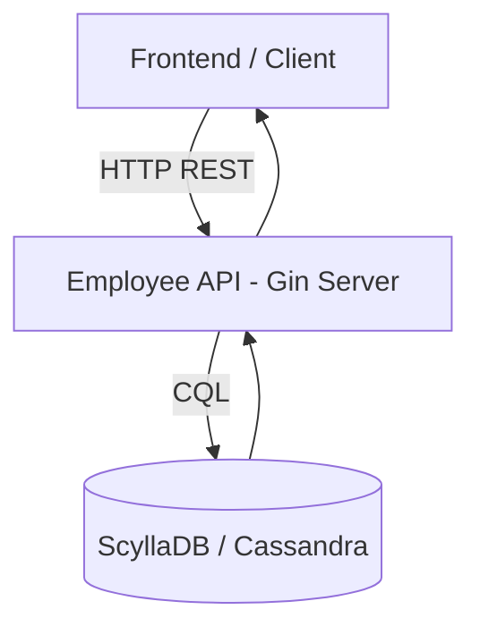

# **Employee API | Backend Service Setup & Deployment Documentation**

<p align="center">
  
</p>

---

## **Authors**

| Author         | Created On | Version | Last Updated By | Last Edited On | Reviewer |
| -------------- | ---------- | ------- | --------------- | -------------- | -------- |
| Syed Rehan Ali | 19-12-2025 | 1.1     | Syed Rehan Ali  | 20-12-2025     | —        |

---

<details>
<summary><h2><strong>Table of Contents</strong></h2></summary>

* [Introduction](#introduction)
* [Purpose of This Document](#purpose-of-this-document)
* [System Architecture](#system-architecture)
* [Tools & Technologies](#tools--technologies)
* [Database Architecture](#database-architecture)
* [Project Structure Explained](#project-structure-explained)
* [Configuration Management](#configuration-management)
* [Step-by-Step Setup Guide](#step-by-step-setup-guide)
* [Build & Dependency Management Notes](#build--dependency-management-notes)
* [Running Employee API (Actual Mode)](#running-employee-api-actual-mode)
* [API Exposure & Networking](#api-exposure--networking)
* [Database Safety & Isolation](#database-safety--isolation)
* [Operational Commands](#operational-commands)
* [Troubleshooting](#troubleshooting)
* [Best Practices](#best-practices)
* [Conclusion](#conclusion)

</details>

---

## **Introduction**

The **Employee API** is a production-ready backend service written in **Go (Golang)** using the **Gin framework**, designed to expose employee-related business APIs backed by a **distributed NoSQL database (ScyllaDB / Apache Cassandra)**.

This document describes the **ACTUAL setup**, where:

* The API is connected to a **real database**
* The service runs on a **server IP**
* Other teams (Frontend / Database) can safely integrate
* No mock or dummy layers are involved

---

## **Purpose of This Document**

This document ensures:

* Clear understanding of **how the API works**
* Safe integration with **real databases**
* Confidence for **DB and frontend teams**
* Repeatable deployment across environments (DEV / QA / UAT)

---

## **System Architecture**



---

## **Tools & Technologies**

| Tool                 | Purpose                   |
| -------------------- | ------------------------- |
| Go (1.20+)           | Backend language          |
| Gin                  | HTTP routing & middleware |
| Viper                | Configuration management  |
| ScyllaDB / Cassandra | Distributed NoSQL DB      |
| systemd              | Service management        |
| Linux (Ubuntu)       | Hosting OS                |

---

## **Database Architecture**

### **Why ScyllaDB / Cassandra**

| Feature            | Benefit                        |
| ------------------ | ------------------------------ |
| Distributed        | No single point of failure     |
| High throughput    | Handles large read/write loads |
| Horizontal scaling | Easy node expansion            |
| CQL support        | SQL-like querying              |

---

### **Database Communication Flow**

1. API receives HTTP request
2. API validates input
3. API executes CQL query
4. DB responds
5. API returns JSON response

---

## **Project Structure Explained**

```text
employee-api/
├── api/
│   ├── api.go          # Employee CRUD logic (DB connected)
│   ├── health.go       # Health endpoints
│
├── config/
│   ├── viper.go        # Reads config.yaml
│
├── model/
│   ├── employee.go    # Data models
│
├── routes/
│   ├── routes.go      # API routing
│
├── middleware/
│   ├── logging.go     # Request logging
│
├── migration/
│   ├── *.cql          # DB schema files
│
├── main.go             # Application entrypoint
├── config.yaml         # Environment config
└── go.mod
```

---

## **Configuration Management**

### **config.yaml**

```yaml
server:
  port: 8082

database:
  host: 127.0.0.1
  port: 9042
  keyspace: employee_ks
  username: cassandra
  password: cassandra
```

### **How Viper Works**

| Step          | Description            |
| ------------- | ---------------------- |
| Load file     | Reads config.yaml      |
| Map values    | Converts to Go structs |
| Inject config | Used by DB & server    |

---

## **Step-by-Step Setup Guide**

### **Step 1: Install Go**

```bash
sudo apt install golang -y
```

---

### **Step 2: Install ScyllaDB / Cassandra**

> ⚠️ Only ONE DB is required, not both

#### **Option A: Cassandra**

```bash
sudo apt install cassandra -y
sudo systemctl enable cassandra
sudo systemctl start cassandra
```

#### **Option B: ScyllaDB**

```bash
sudo apt install scylla -y
sudo scylla_setup
```

---

### **Step 3: Create Keyspace**

```sql
CREATE KEYSPACE employee_ks
WITH replication = {
  'class': 'SimpleStrategy',
  'replication_factor': 1
};
```

---

### **Step 4: Run Migrations**

```bash
cqlsh -f migration/001_employee_table.cql
```

---

## **Build & Dependency Management Notes**

### **Handling Dependencies**

1. Download all modules:

```bash
go mod download -x
```

> ⚠️ The `-x` flag prints commands to debug slow downloads or compilation.

2. Some packages (like `github.com/ugorji/go/codec`) may take time on first build — this is normal.

---

### **Building the API**

1. Clean previous builds:

```bash
go clean
```

2. Precompile dependencies (optional, speeds up main build):

```bash
go install -v ./...
```

3. Build the main API binary:

```bash
go build -v -o employee-api main.go
```

> Ensure all local package imports exist relative to your module to avoid `package ... is not in std` errors.

---

### **Common Build Issues & Fixes**

| Issue                                                              | Cause                                    | Solution                                                |
| ------------------------------------------------------------------ | ---------------------------------------- | ------------------------------------------------------- |
| `named files must all be in one directory; have routes and config` | Trying to build multiple directories     | Build only `main.go` or remove `mock` files             |
| Build seems stuck                                                  | Large dependencies compiling             | Wait; first-time build of packages can be CPU-intensive |
| `cannot write multiple packages to non-directory`                  | Using `go build -o` on multiple packages | Use `go install ./...` or build `main.go` only          |
| `package ... is not in std`                                        | Wrong import paths                       | Check `go.mod` and ensure local modules exist           |

---

## **Running Employee API (Actual Mode)**

### **Run API**

```bash
export GIN_MODE=release
./employee-api
```

Expected:

```
Listening on :8082
Connected to ScyllaDB
```

---

## **API Exposure & Networking**

### **Expose API via Server IP**

```text
http://<SERVER_IP>:8082/api/v1/employee
```

### **Firewall / Security Group**

| Rule     | Value           |
| -------- | --------------- |
| Port     | 8082            |
| Protocol | TCP             |
| Source   | Frontend subnet |

---

## **Database Safety & Isolation**

### ❓ Will this affect DB team systems?

**NO — if configured correctly**

| Scenario                | Impact                  |
| ----------------------- | ----------------------- |
| API connects to DEV DB  | Safe                    |
| API connects to PROD DB | Requires approval       |
| Wrong credentials       | Connection fails safely |
| API down                | DB unaffected           |

✔ API is a **client**, not a controller
✔ DB team owns DB lifecycle
✔ API cannot destroy DB infra

---

## **Operational Commands**

| Command                        | Purpose       |
| ------------------------------ | ------------- |
| `systemctl start employee-api` | Start service |
| `systemctl stop employee-api`  | Stop service  |
| `journalctl -u employee-api`   | Logs          |
| `netstat -tulpn`               | Port check    |

---

## **Troubleshooting**

| Issue                | Cause             | Solution                                         |
| -------------------- | ----------------- | ------------------------------------------------ |
| DB connection failed | Wrong config      | Check config.yaml                                |
| API not reachable    | Firewall          | Open port                                        |
| High latency         | DB overload       | Check Scylla metrics                             |
| Panic on startup     | Migration missing | Run CQL files                                    |
| Build stuck          | Large dependency  | Use `go install ./...` first, then build main.go |

---

## **Best Practices**

| Practice            | Reason             |
| ------------------- | ------------------ |
| Separate DB per env | Prevent data leaks |
| Read-only DB users  | Extra safety       |
| Health checks       | Monitoring         |
| Logging middleware  | Debugging          |

---

## **Conclusion**

This document defines a **real, production-grade Employee API setup** that:

* Safely connects to ScyllaDB / Cassandra
* Can be exposed on server IP
* Does **NOT** interfere with DB team ownership
* Supports scalable, secure enterprise usage

---

### ✅ You are safe to:

* Expose this API
* Share it with frontend teams
* Allow DB team connectivity
* Run it on your server IP
