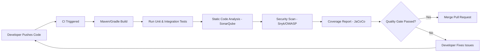

#**Java CI Checks & Bugs Analysis Documentation**


---

# **Status Badges (Optional)**

```


```

---

## **Table of Contents**

1. [Introduction](#introduction)
2. [What Are Java CI Checks?](#what-are-java-ci-checks)
3. [Java CI Workflow](#java-ci-workflow)
4. [Tools Used](#tools-used-in-java-ci--bug-analysis)
5. [Tool Comparison](#tool-comparison)
6. [Advantages](#advantages-of-java-ci-checks)
7. [POC Pipeline](#poc-java-ci-pipeline-implementation)
8. [Best Practices](#best-practices)
9. [Screenshot Placeholders](#screenshot-placeholders)
10. [Conclusion](#conclusion)
11. [Contact Information](#contact-information)
12. [References](#references)

---

## **Introduction**

| Section     | Description                                                                                      |
| ----------- | ------------------------------------------------------------------------------------------------ |
| **Purpose** | Complete reference for Java CI checks and automated bug analysis                                 |
| **Covers**  | CI workflow, tools (SonarQube, JaCoCo, Snyk, etc.), POC pipeline, best practices, recommendation |
| **Goal**    | Provide a **single comprehensive guide** for Java code quality automation and CI implementation  |

---

## **What Are Java CI Checks?**

| Aspect             | Description                                                                                                                                             |
| ------------------ | ------------------------------------------------------------------------------------------------------------------------------------------------------- |
| **Definition**     | Automated validation steps that run on code push or pull request to ensure build, test, and quality standards are met                                   |
| **Checks Include** | Build compilation, Unit & Integration tests, Static code analysis, Bug detection, Security scanning, Code coverage, Formatting, Quality Gate validation |
| **Importance**     | Early bug detection, improved code quality, security compliance, stable builds, automation, team accountability                                         |

---

## **Java CI Workflow**

| Step | Action                | Description                                     |
| ---- | --------------------- | ----------------------------------------------- |
| 1    | Developer pushes code | Triggers GitHub Actions workflow                |
| 2    | Build                 | Maven/Gradle compiles the project               |
| 3    | Run tests             | Unit and integration tests execute              |
| 4    | Static analysis       | SonarQube scans for bugs and code smells        |
| 5    | Coverage check        | JaCoCo generates coverage metrics               |
| 6    | Security scan         | Snyk/OWASP Dependency Check scans dependencies  |
| 7    | Quality Gate          | Determines if code meets standards before merge |
| 8    | Merge PR              | Only allowed if all checks pass                 |

---

### **Workflow Diagram**



---

## **Tools Used in Java CI & Bug Analysis**

| Category          | Tools                                            |
| ----------------- | ------------------------------------------------ |
| Build             | Maven, Gradle                                    |
| CI/CD             | GitHub Actions, Jenkins, GitLab CI, Azure DevOps |
| Static Analysis   | SonarQube, SpotBugs, PMD, Checkstyle             |
| Code Coverage     | JaCoCo, Cobertura                                |
| Security Scanning | Snyk, OWASP Dependency Check                     |

---

## **Tool Comparison**

| Tool                   | Purpose                                        | Strengths                                  | Weaknesses                       |
| ---------------------- | ---------------------------------------------- | ------------------------------------------ | -------------------------------- |
| SonarQube              | Static analysis, bug & vulnerability detection | Deep analysis, Quality Gates, integrations | Requires setup and configuration |
| SpotBugs               | Bug detection                                  | Bytecode-level scanning                    | Limited UI, fewer features       |
| PMD                    | Code smells                                    | Good ruleset                               | No security scanning             |
| Checkstyle             | Formatting & style                             | Enforces consistent style                  | No bug detection                 |
| Snyk                   | Security scanning                              | Large CVE database, good reporting         | Paid tiers for advanced features |
| OWASP Dependency Check | Vulnerabilities                                | Open-source                                | More false positives             |

---

## **Advantages of Java CI Checks**

| Advantage              | Description                                |
| ---------------------- | ------------------------------------------ |
| Improved Code Quality  | Enforces standards and consistent code     |
| Early Bug Detection    | Catches defects before merge               |
| Security Compliance    | Identifies vulnerabilities in dependencies |
| Stable Builds          | Prevents broken code in main branch        |
| Developer Productivity | Reduces manual testing effort              |
| Faster Release Cycles  | Automates CI/CD workflow                   |

---

## **POC – Java CI Pipeline Implementation**

### **Folder Structure**

| Folder               | Description                      |
| -------------------- | -------------------------------- |
| `/src/main/java`     | Application source code          |
| `/src/test/java`     | Unit & integration tests         |
| `/.github/workflows` | GitHub Actions CI pipeline YAML  |
| `/reports/sonar`     | SonarQube analysis reports       |
| `/reports/jacoco`    | Coverage reports                 |
| `/reports/security`  | Dependency security scan outputs |
| `pom.xml`            | Maven project configuration      |
| `README.md`          | Project documentation            |

### **GitHub Actions Workflow**

```yaml
name: Java CI Pipeline

on:
  push:
  pull_request:

jobs:
  build:
    runs-on: ubuntu-latest

    steps:
      - uses: actions/checkout@v4

      - uses: actions/setup-java@v4
        with:
          distribution: 'temurin'
          java-version: '17'

      - name: Build & Test
        run: mvn -B clean verify

      - name: SonarCloud Scan
        uses: SonarSource/sonarcloud-github-action@v2
        with:
          args: >
            -Dsonar.projectKey=PROJECT_KEY
            -Dsonar.organization=ORG
            -Dsonar.login=${{ secrets.SONAR_TOKEN }}

      - name: Generate Coverage
        run: mvn jacoco:report
```

---

## **Best Practices**

| Best Practice            | Description                           |
| ------------------------ | ------------------------------------- |
| Enforce Quality Gates    | Block merges failing SonarQube rules  |
| Maintain 80%+ coverage   | Ensure reliable code                  |
| Run scans on every PR    | Prevent unreviewed code entering main |
| Automate formatting      | Use Checkstyle/PMD                    |
| Scan dependencies weekly | OWASP/Snyk scans                      |
| Protect main branch      | Require CI checks to pass             |

---

## **Screenshot Placeholders**

| Screenshot              | Placeholder                                          |
| ----------------------- | ---------------------------------------------------- |
| SonarQube Dashboard     | `[ INSERT SONARQUBE DASHBOARD SCREENSHOT HERE ]`     |
| JaCoCo Coverage Report  | `[ INSERT JACOCO COVERAGE REPORT SCREENSHOT HERE ]`  |
| Security Scan           | `[ INSERT SECURITY SCAN OUTPUT HERE ]`               |
| GitHub Actions Pipeline | `[ INSERT GITHUB ACTIONS PIPELINE SCREENSHOT HERE ]` |

---

## **Conclusion**

| Section       | Details                                                                                                                                     |
| ------------- | ------------------------------------------------------------------------------------------------------------------------------------------- |
| **Decision**  | Use **SonarQube / SonarCloud** for Java CI checks and bug analysis                                                                          |
| **Reasoning** | Best static analysis, detects bugs, code smells, vulnerabilities; integrates with GitHub Actions; supports Quality Gates; works with JaCoCo |
| **Outcome**   | Ensures high-quality code, early defect detection, security compliance, and automated workflow enforcement                                  |

---

## **Contact Information**

| Name           | Email                                                                                   |
| -------------- | --------------------------------------------------------------------------------------- |
| Syed Rehan Ali | [syed.rehan.ali.snaatak@mygurukulum.com](mailto:syed.rehan.ali.snaatak@mygurukulum.com) |

---

## **References**

| Resource               | Link                                                                   |
| ---------------------- | ---------------------------------------------------------------------- |
| SonarSource            | [https://www.sonarsource.com](https://www.sonarsource.com)             |
| SpotBugs               | [https://spotbugs.github.io](https://spotbugs.github.io)               |
| OWASP Dependency Check | [https://owasp.org](https://owasp.org)                                 |
| PMD                    | [https://pmd.github.io](https://pmd.github.io)                         |
| Checkstyle             | [https://checkstyle.sourceforge.io](https://checkstyle.sourceforge.io) |
| GitHub Actions Docs    | [https://docs.github.com/actions](https://docs.github.com/actions)     |
| Maven                  | [https://maven.apache.org](https://maven.apache.org)                   |
