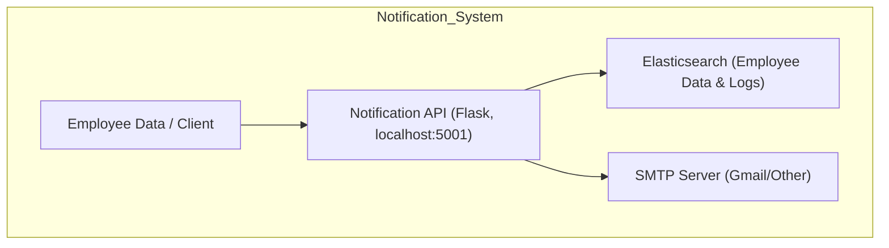
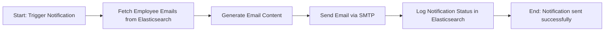

# Notification API Implementation Document

<details>
<summary>Table of Contents</summary>

1. [Authors](#authors)
2. [Overview](#overview)
3. [Prerequisites](#prerequisites)
4. [Step-by-Step Implementation](#step-by-step-implementation)

   * [Step 0: Clone the Repository](#step-0-clone-the-repository)
   * [Step 1: Navigate to Project](#step-1-navigate-to-project)
   * [Step 2: Install Dependencies](#step-2-install-dependencies)
   * [Step 3: Configure SMTP & Elasticsearch](#step-3-configure-smtp--elasticsearch)
   * [Step 4: Add Employee Data](#step-4-add-employee-data)
   * [Step 5: Fix Python Code Issues](#step-5-fix-python-code-issues)
   * [Step 6: Set Config Environment Variable](#step-6-set-config-environment-variable)
   * [Step 7: Run Notification Script](#step-7-run-notification-script)
   * [Step 8: Optional Cron Scheduling](#step-8-optional-cron-scheduling)
   * [Step 9: EC2 Metadata Token for Public IP](#step-9-ec2-metadata-token-for-public-ip)
5. [Frontend Proxy Setup](#frontend-proxy-setup)
6. [Architecture & Workflow](#architecture--workflow)
7. [FAQs](#faqs)
8. [Troubleshooting](#troubleshooting)
9. [Reference Table](#reference-table)

</details>

---

## Authors

| Author         | Created on | Version | Last updated by | Last Edited On | Reviewer |
| -------------- | ---------- | ------- | --------------- | -------------- | -------- |
| Syed Rehan Ali | 2025-11-10 | 1.1     | Syed Rehan Ali  | 2025-11-10     | Team     |
| Syed Rehan Ali |            | 1.2     | Syed Rehan Ali  |                |          |
| Syed Rehan Ali |            | 1.3     | Syed Rehan Ali  | 2025-12-26     |          |

---

## Overview

This document provides a **Step-by-Step Standard Operating Procedure (SOP)** for the **Notification API**, a microservice designed to send email notifications to employees.

The SOP is intended for developers, DevOps engineers, and QA teams deploying, testing, or maintaining the Notification API.

**Repository:** [Notification Worker GitHub](https://github.com/OT-MICROSERVICES/notification-worker)

---

## Prerequisites

* Ubuntu 20.04+ (or compatible Linux)
* Python 3.10+ and pip3
* Elasticsearch 8.x installed on local/remote server
* SMTP account (Gmail recommended)
* EC2 instance with public IP (if deploying on AWS)
* `curl` installed
* `nano` or any text editor

---

## Step-by-Step Implementation

### Step 0: Clone the Repository

```bash
git clone https://github.com/OT-MICROSERVICES/notification-worker.git
```

### Step 1: Navigate to Project

```bash
cd ~/notification-worker
```

---

### Step 2: Install Dependencies

```bash
pip3 install -r requirements.txt --user
```

> Installs required Python libraries listed in `requirements.txt`.

---

### Step 3: Configure SMTP & Elasticsearch

Edit `config.yaml`:

```yaml
smtp:
  from: "your-email@gmail.com"
  username: "your-email@gmail.com"
  password: "your-app-password"
  smtp_server: "smtp.gmail.com"
  smtp_port: "587"

elasticsearch:
  username: "elastic"
  password: "elastic-password"
  host: "127.0.0.1"
  port: 9200
  use_ssl: true        # enable HTTPS
  verify_certs: false  # use false if self-signed certificate
```

> Notes:
>
> * Elasticsearch must be running and listening on the specified IP.
> * If running on AWS EC2, allow inbound port `9200` in security group.
> * `verify_certs: false` avoids SSL errors for self-signed certificates.

---

### Step 4: Add Employee Data

```bash
curl -X POST "https://127.0.0.1:9200/employee-management/_doc/1" \
-u elastic:elastic-password \
-H 'Content-Type: application/json' \
-d '{"email": "rehan.ali9325@gmail.com","name": "Rehan Ali"}' \
--insecure
```

> Adds a test employee to Elasticsearch. Use `--insecure` for self-signed SSL.

---

### Step 5: Fix Python Code Issues

Test script runs:

```bash
python3 notification_api.py --mode scheduled   # runs monthly
python3 notification_api.py --mode external    # runs once manually
```

---

### Step 6: Set Config Environment Variable

```bash
export CONFIG_FILE=/home/ubuntu/notification-worker/config.yaml
```

> Ensures Python script reads correct config.

---

### Step 7: Run Notification Script

```bash
python3 notification_api.py --mode external
```

> Logs will show success or errors while sending notifications.

---

### Step 8: Optional Cron Scheduling

```cron
0 0 1 * * CONFIG_FILE=/home/ubuntu/notification-worker/config.yaml /usr/bin/python3 /home/ubuntu/notification-worker/notification_api.py --mode external
```

> Runs notification on the first of every month.

---

### Step 9: EC2 Metadata Token for Public IP (If Using AWS)

```bash
# Get a temporary token
TOKEN=$(curl -X PUT "http://169.254.169.254/latest/api/token" \
  -H "X-aws-ec2-metadata-token-ttl-seconds: 21600")

# Get public IP
curl -H "X-aws-ec2-metadata-token: $TOKEN" http://169.254.169.254/latest/meta-data/public-ipv4
```

> Use this IP in your `config.yaml` if connecting from outside AWS.

---

## Frontend Proxy Setup

```javascript
const { createProxyMiddleware } = require('http-proxy-middleware');

module.exports = function(app) {
  app.use('/notification', createProxyMiddleware({ target: 'http://localhost:5001', changeOrigin: true }));
};
```

---

## Architecture & Workflow

### Architecture Diagram (Notification API Only)



### Workflow Diagram



---

## FAQs

* [Why use a proxy in React?](https://create-react-app.dev/docs/proxying-api-requests-in-development/)
* [CORS explanation](https://developer.mozilla.org/en-US/docs/Web/HTTP/CORS)
* [Elasticsearch Python Client](https://www.elastic.co/guide/en/elasticsearch/client/python-api/current/index.html)

---

## Troubleshooting

1. **Config file not found**

```bash
python3 notification_api.py --mode external
```

* Ensure `CONFIG_FILE` points to correct path:

```bash
export CONFIG_FILE=/home/ubuntu/notification-worker/config.yaml
```

2. **Connection refused / RemoteDisconnected**

```bash
sudo systemctl status elasticsearch
sudo systemctl start elasticsearch
```

* Ensure Elasticsearch is running and listening on the IP/port in `config.yaml`.

3. **HTTPS / Authentication issues**

```bash
curl -u elastic:elastic-password https://127.0.0.1:9200 --insecure
```

* Use HTTPS and valid credentials in `config.yaml`.
* For self-signed certificates, set `verify_certs: false`.

4. **SMTP errors**

* Check Gmail app password or SMTP settings.
* Ensure port `587` for TLS/STARTTLS.

---

## Reference Table

| Reference                   | Description                            | Link                                                                                               |
| --------------------------- | -------------------------------------- | -------------------------------------------------------------------------------------------------- |
| Notification API Repo       | Source code and main repo              | [GitHub](https://github.com/OT-MICROSERVICES/notification-worker)                                  |
| Gmail App Passwords         | How to generate app passwords for SMTP | [Google Account](https://myaccount.google.com/apppasswords)                                        |
| Elasticsearch Python Client | Official Python client documentation   | [Elastic Docs](https://www.elastic.co/guide/en/elasticsearch/client/python-api/current/index.html) |
| Cron Jobs                   | Scheduling scripts in Linux            | [Cron Tutorial](https://crontab.guru/)                                                             |
