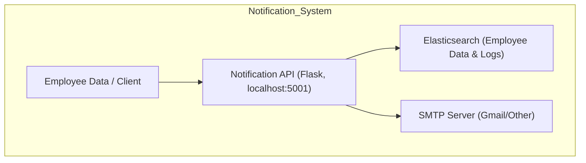

# Notification API Implementation Document

<details>
<summary>Table of Contents</summary>

1. [Authors](#authors)
2. [Overview](#overview)
3. [Prerequisites](#prerequisites)
4. [Step-by-Step Implementation](#step-by-step-implementation)

   * [Step 0: Clone the Repository](#step-0-clone-the-repository)
   * [Step 1: Navigate to Project](#step-1-navigate-to-project)
   * [Step 1a: Setup Virtual Environment](#step-1a-setup-virtual-environment)
   * [Step 2: Install Dependencies](#step-2-install-dependencies)
   * [Step 3: Configure SMTP & Elasticsearch](#step-3-configure-smtp--elasticsearch)
   * [Step 4: Add Employee Data](#step-4-add-employee-data)
   * [Why We Are Using Elasticsearch](#why-we-are-using-elasticsearch)
   * [Step 5: Run Notification Script](#step-5-run-notification-script)
   * [Step 6: Set Config Environment Variable](#step-6-set-config-environment-variable)
   * [Step 7: Optional Cron Scheduling](#step-7-optional-cron-scheduling)
   * [Step 8: Elasticsearch Troubleshooting](#step-8-elasticsearch-troubleshooting)
   * [Step 9: Deactivate & Reactivate venv](#step-9-deactivate--reactivate-venv)
5. [Frontend Proxy Setup](#frontend-proxy-setup)
6. [Architecture & Workflow](#architecture--workflow)
7. [FAQs](#faqs)
8. [Reference Table](#reference-table)

</details>

---

## Author Table

| Author         | Created on | Version | Last updated by | Last Edited On | Reviewer |
| -------------- | ---------- | ------- | --------------- | -------------- | -------- |
| Syed Rehan Ali | 2025-11-10 | 1.1     | Syed Rehan Ali  | 2025-11-10     | Team     |

---

## Overview

The **Notification API** is a microservice that sends emails to employees.
It fetches employee data from Elasticsearch, generates emails, sends them via SMTP, and logs notifications in Elasticsearch.

---

## Prerequisites

* Python 3.10+
* pip3
* Access to Elasticsearch server
* Gmail account or other SMTP credentials
* EC2 instance with public IP (if deploying on AWS)
* `curl` for testing endpoints

---

## Step-by-Step Implementation

### Step 0: Clone the Repository

```bash
git clone https://github.com/OT-MICROSERVICES/notification-worker.git
```

### Step 1: Navigate to Project

```bash
cd ~/notification-worker
```


### Step 1a: Setup Virtual Environment

1. **Create venv** (if not created):

```bash
python3 -m venv venv
```

2. **Activate venv**:

```bash
source venv/bin/activate
```

Your shell prompt will show `(venv)`.

3. **Install dependencies** inside venv:

```bash
pip install -r requirements.txt
```


### Step 2: Install Dependencies (if venv already active)

```bash
pip install -r requirements.txt
```


### Step 3: Configure SMTP & Elasticsearch

Edit `config.yaml`:

```yaml
smtp:
  from: "rehan.ali9325@gmail.com"
  username: "rehan.ali9325@gmail.com"
  password: "your-app-password"  # Gmail app password
  smtp_server: "smtp.gmail.com"
  smtp_port: "587"               # TLS port

elasticsearch:
  username: "elastic"
  password: "elastic"            # Elasticsearch password
  host: "127.0.0.1"
  port: 9200
  scheme: "https"
  use_ssl: true
  verify_certs: false            # set false for self-signed cert
```

**Tips:**

* For Elasticsearch external access, ensure `elasticsearch.yml` has `network.host: 0.0.0.0` and the EC2 security group allows inbound 9200.
* Use `elasticsearch-reset-password -u elastic` to set an easy password.


### Step 4: Add Employee Data

```bash
curl -X POST "https://127.0.0.1:9200/employee-management/_doc/1" \
-u elastic:elastic \
-H 'Content-Type: application/json' \
-d '{"email": "rehan.ali9325@gmail.com","name": "Rehan Ali"}' \
--insecure
```


### Why We Are Using Elasticsearch

* Fast retrieval of employee emails
* Scalable storage
* Structured logging
* Easy Python integration


### Step 5: Run Notification Script

Activate venv and run:

```bash
source venv/bin/activate
export CONFIG_FILE=/home/ubuntu/notification-worker/config.yaml
python3 notification_api.py --mode external
```


### Step 6: Set Config Environment Variable

```bash
export CONFIG_FILE=/home/ubuntu/notification-worker/config.yaml
```


### Step 7: Optional Cron Scheduling

```cron
0 * * * * CONFIG_FILE=/home/ubuntu/notification-worker/config.yaml /usr/bin/python3 /home/ubuntu/notification-worker/notification_api.py --mode external
```

---

### Step 8: Elasticsearch Troubleshooting

1. **Check service status**:

```bash
sudo systemctl status elasticsearch.service
```

2. **Start Elasticsearch**:

```bash
sudo systemctl start elasticsearch.service
```

3. **Enable service at boot**:

```bash
sudo systemctl enable elasticsearch.service
```

4. **Test Elasticsearch connection**:

```bash
curl -u elastic:elastic https://127.0.0.1:9200 --insecure
```

5. **Reset password if login fails**:

```bash
sudo /usr/share/elasticsearch/bin/elasticsearch-reset-password -u elastic -i
```


### Step 9: Deactivate & Reactivate venv

**Deactivate:**

```bash
deactivate
```

**Reactivate later:**

```bash
cd ~/notification-worker
source venv/bin/activate
```


## Frontend Proxy Setup

```javascript
const { createProxyMiddleware } = require('http-proxy-middleware');

module.exports = function(app) {
  app.use('/notification', createProxyMiddleware({ target: 'http://localhost:5001', changeOrigin: true }));
};
```


## Architecture & Workflow



## FAQs

* [Why use a proxy in React?](https://create-react-app.dev/docs/proxying-api-requests-in-development/)
* [CORS explanation](https://developer.mozilla.org/en-US/docs/Web/HTTP/CORS)
* [Elasticsearch Python Client](https://www.elastic.co/guide/en/elasticsearch/client/python-api/current/index.html)


## Reference Table

| Reference                   | Description                            | Link                                                                                               |
| --------------------------- | -------------------------------------- | -------------------------------------------------------------------------------------------------- |
| Notification API Repo       | Source code and main repo              | [GitHub](https://github.com/OT-MICROSERVICES/notification-worker)                                  |
| Gmail App Passwords         | How to generate app passwords for SMTP | [Google Account](https://myaccount.google.com/apppasswords)                                        |
| Elasticsearch Python Client | Official Python client documentation   | [Elastic Docs](https://www.elastic.co/guide/en/elasticsearch/client/python-api/current/index.html) |
| Cron Jobs                   | Scheduling scripts in Linux            | [Cron Tutorial](https://crontab.guru/)                                                             |
