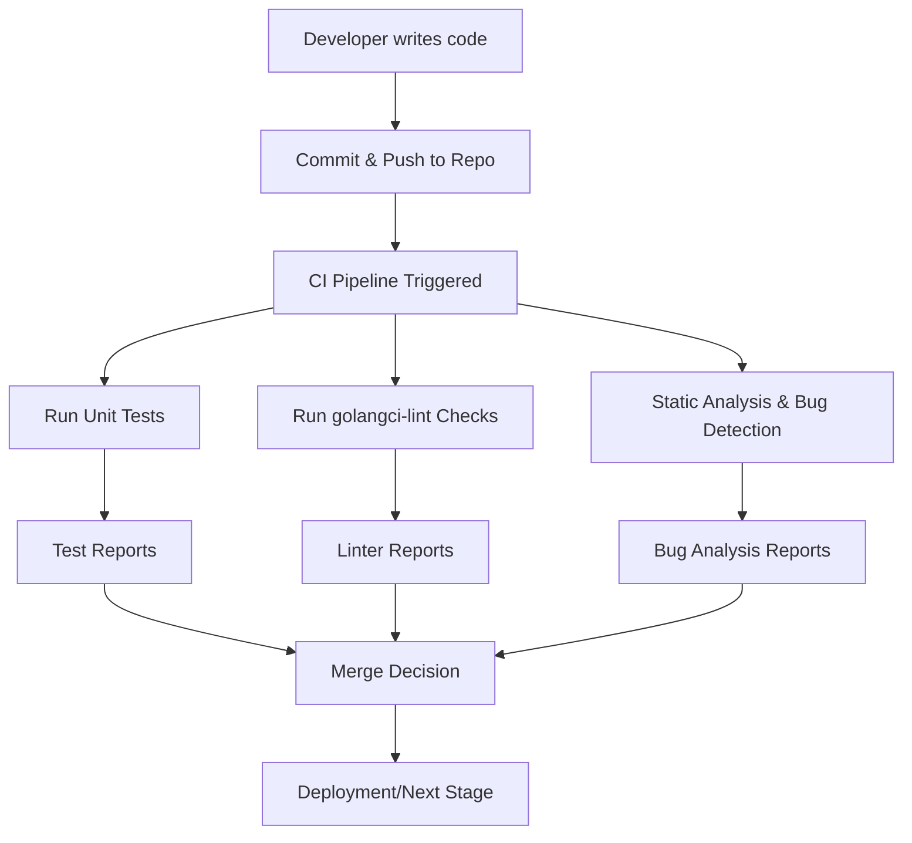

# GoLang CI Checks & Bug Analysis POC Document


---

## **Authors**

| Author         | Created on | Version | Last updated by | Last Edited On | Level        | Reviewer |
| -------------- | ---------- | ------- | --------------- | -------------- | ------------ | -------- |
| Syed Rehan Ali | 2025-11-21 | 1.0     | Syed Rehan Ali  | 2025-11-21     | Pre Reviewer | Aman     |
| Syed Rehan Ali | 2025-11-21 | 1.1     | Syed Rehan Ali  | 2025-11-21     | L0 Reviewer  | Anjali   |

---

<details>  
<summary>Table of Contents</summary>

1. [Purpose](#purpose)
2. [Introduction](#introduction)

   * [What is GoLang CI & Bug Analysis](#what-is-golang-ci--bug-analysis)
   * [Why CI Checks & Bug Analysis](#why-ci-checks--bug-analysis)
3. [Workflow Diagram](#workflow-diagram)
4. [Tools Overview](#tools-overview)
5. [Comparison Table](#comparison-table-of-tools)
6. [Advantages](#advantages)
7. [POC Implementation](#poc-implementation)
8. [Best Practices](#best-practices)
9. [Recommendation & Conclusion](#recommendation--conclusion)
10. [Contact Information](#contact-information)
11. [References](#references)

</details>

---

## Purpose

This document evaluates **GoLang CI checks and bug analysis tools** to define a workflow for automated testing, bug detection, and reporting. It provides a proof-of-concept (POC) approach with recommendations for the most suitable tools and practices for our current project.

---

## Introduction

### What is GoLang CI & Bug Analysis

GoLang CI checks are automated processes that validate **code quality, formatting, test coverage, and static analysis**. Bug analysis tools detect **errors, potential security issues, and runtime failures** during development and in CI/CD pipelines.

| Term             | Definition                                                                                                |
| ---------------- | --------------------------------------------------------------------------------------------------------- |
| **CI Checks**    | Continuous Integration automated processes including `golangci-lint`, unit tests, and build verification. |
| **Bug Analysis** | Tools and practices to find, categorize, and resolve code issues and vulnerabilities.                     |

### Why CI Checks & Bug Analysis

| Reason                  | Description                                                            |
| ----------------------- | ---------------------------------------------------------------------- |
| Consistent Code Quality | Ensure uniform style, structure, and test coverage across the project. |
| Early Bug Detection     | Detect errors before deployment to reduce cost and effort.             |
| Team Collaboration      | Automate code reviews and reporting for multiple contributors.         |
| CI/CD Scalability       | Supports automated pipelines for testing and deployment.               |

---

## Workflow Diagram



---

## Tools Overview

| Tool                  | Purpose                           | Key Features                                            |
| --------------------- | --------------------------------- | ------------------------------------------------------- |
| **golangci-lint**     | Linting & static code analysis    | Supports multiple linters, fast, integrates with CI/CD  |
| **Go Vet**            | Code correctness & bug detection  | Detects suspicious constructs, potential runtime errors |
| **Go Test**           | Unit & integration testing        | Built-in testing framework, supports coverage reports   |
| **SonarQube**         | Static analysis & quality metrics | Code smells, vulnerabilities, integration with Go       |
| **Snyk / Dependabot** | Dependency vulnerability scanning | Detects security issues in dependencies                 |
| **Delve**             | Debugging tool                    | Step-through debugging for Go applications              |

---

## Comparison Table of Tools

| Aspect               | golangci-lint       | Go Vet               | Go Test       | SonarQube          | Snyk/Dependabot   | Delve             |
| -------------------- | ------------------- | -------------------- | ------------- | ------------------ | ----------------- | ----------------- |
| Type                 | Linter/Static Check | Static Analysis      | Testing       | Static Analysis    | Security Scan     | Debugging         |
| CI/CD Integration    | Easy                | Built-in             | Easy          | Moderate           | Easy              | Manual            |
| Coverage             | Code style & errors | Syntax & correctness | Unit coverage | Bugs & code smells | Vulnerabilities   | Runtime debugging |
| Ease of Setup        | High                | High                 | High          | Moderate           | High              | Moderate          |
| Recommended Use Case | Code quality        | Quick checks         | Unit testing  | Quality metrics    | Security scanning | Debugging errors  |

---

## Advantages

| Advantage             | Description                                                    |
| --------------------- | -------------------------------------------------------------- |
| Automation            | CI checks reduce manual review overhead.                       |
| Early bug detection   | Identifies errors before deployment, reducing cost and effort. |
| Improved code quality | Ensures consistent style, linting, and test coverage.          |
| Security compliance   | Detects vulnerabilities in dependencies and source code.       |
| Scalability           | Integrates easily into CI/CD pipelines for teams of any size.  |
| Faster feedback loop  | Developers get immediate insights on code issues.              |

---

## POC Implementation

**Project Setup:**

1. **Repo Structure**

   ```
   /my-go-project
   ├── cmd/
   ├── internal/
   ├── pkg/
   ├── go.mod
   └── .golangci.yml
   ```

2. **CI Pipeline Example (GitHub Actions)**

   ```yaml
   name: Go CI

   on: [push, pull_request]

   jobs:
     build:
       runs-on: ubuntu-latest
       steps:
       - uses: actions/checkout@v3
       - name: Set up Go
         uses: actions/setup-go@v4
         with:
           go-version: 1.21
       - name: Install golangci-lint
         run: go install github.com/golangci/golangci-lint/cmd/golangci-lint@latest
       - name: Run golangci-lint
         run: golangci-lint run
       - name: Run Tests
         run: go test ./... -v -cover
   ```

3. **Bug Analysis**

   * Run `go vet ./...` for correctness checks.
   * Integrate SonarQube for code quality metrics.
   * Use Snyk for dependency vulnerability scanning.

---

## Best Practices

| Best Practice                       | Description                                                            |
| ----------------------------------- | ---------------------------------------------------------------------- |
| Maintain `.golangci.yml`            | Ensures consistent linting rules across the project.                   |
| Write Unit & Integration Tests      | Validate each module and ensure stable code coverage.                  |
| Automate Security Scans             | Detect vulnerabilities automatically during CI/CD runs.                |
| Regularly Review SonarQube Metrics  | Prevent technical debt and track code quality improvements over time.  |
| Combine Code Reviews with CI Checks | Human reviews plus automated checks catch more issues efficiently.     |
| Incremental Adoption                | Start with essential checks, expand gradually to avoid CI bottlenecks. |

---

## Recommendations & Conclusion

| Recommendation                     | Reasoning                                                                                |
| ---------------------------------- | ---------------------------------------------------------------------------------------- |
| **Primary Tool: golangci-lint**    | Combines multiple linters, fast, CI/CD-friendly, early detection of code quality issues. |
| **Go Test**                        | Provides unit and integration test coverage.                                             |
| **Go Vet**                         | Detects suspicious constructs and potential runtime errors.                              |
| **SonarQube**                      | Provides metrics on bugs, code smells, and technical debt.                               |
| **Snyk / Dependabot**              | Scans dependencies for vulnerabilities to ensure secure deployments.                     |
| **Integrate with CI/CD Pipelines** | Ensures automated, repeatable, and scalable checks for all commits and pull requests.    |

**Conclusion:**

Based on the POC, the recommended primary tool is **`golangci-lint`**, complemented with **Go Test, Go Vet, SonarQube, and Snyk** for comprehensive CI checks, bug detection, and security scanning. This combination ensures fast feedback, high code quality, and scalable CI/CD practices for GoLang projects.

---

## Contact Information

| Name           | Email                                                                                   |
| -------------- | --------------------------------------------------------------------------------------- |
| Syed Rehan Ali | [syed.rehan.ali.snaatak@mygurukulum.com](mailto:syed.rehan.ali.snaatak@mygurukulum.com) |

---

## References

| No | Reference                                                                  |
| -- | -------------------------------------------------------------------------- |
| 1  | [https://golangci-lint.run/](https://golangci-lint.run/)                   |
| 2  | [https://golang.org/doc/](https://golang.org/doc/)                         |
| 3  | [https://docs.sonarqube.org/latest/](https://docs.sonarqube.org/latest/)   |
| 4  | [https://snyk.io/](https://snyk.io/)                                       |
| 5  | [https://github.com/actions/setup-go](https://github.com/actions/setup-go) |
| 6  | [https://blog.golang.org/](https://blog.golang.org/)                       |

---
