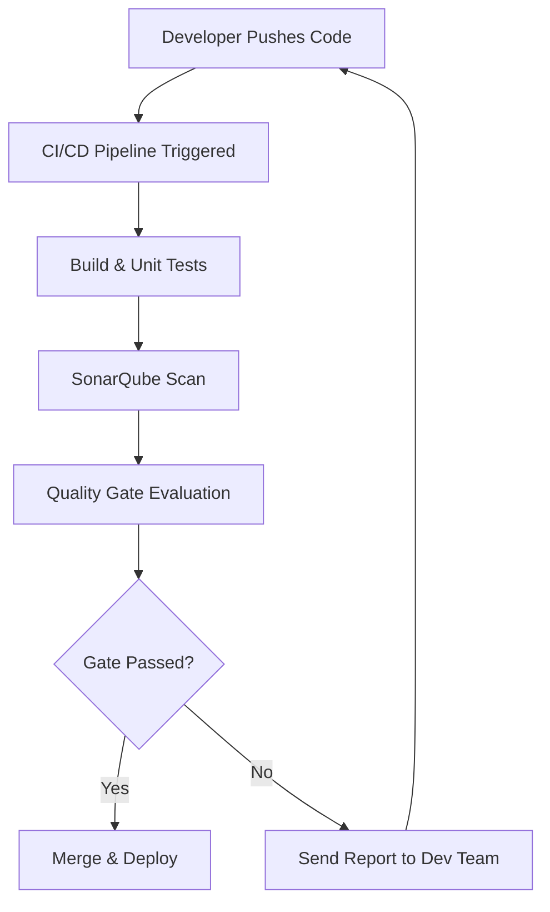
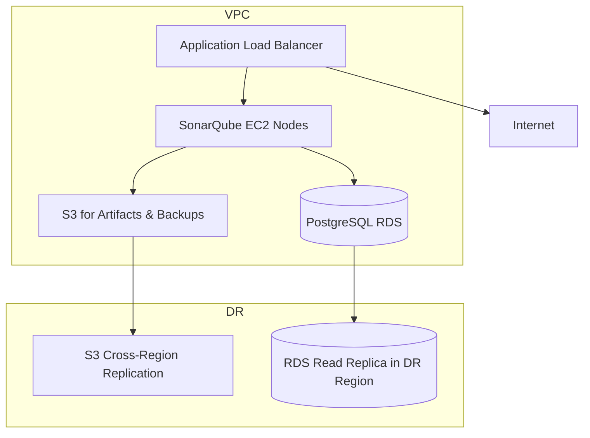

# SonarQube AWS Deployment & DR POC Document

---

## **Authors**

| Author         | Created on | Version | Last updated by | Last Edited On | Level        | Reviewer |
| -------------- | ---------- | ------- | --------------- | -------------- | ------------ | -------- |
| Syed Rehan Ali | 2025-11-21 | 1.0     | Syed Rehan Ali  | 2025-11-21     | Pre Reviewer | Aman     |
| Syed Rehan Ali | 2025-11-21 | 1.1     | Syed Rehan Ali  | 2025-11-21     | L0 Reviewer  | Anjali   |

---

  

Table of Contents

1. [Purpose](#purpose)
2. [Introduction](#introduction)

   * [What is SonarQube](#what-is-sonarqube)
   * [Why SonarQube & AWS Deployment](#why-sonarqube--aws-deployment)
3. [Workflow Diagram](#workflow-diagram)
4. [AWS Infra Diagram](#aws-infra-diagram)
5. [Advantages](#advantages)
6. [Best Practices](#best-practices)
7. [Backup & Disaster Recovery](#backup--disaster-recovery)
8. [Recommendation & Conclusion](#recommendation--conclusion)
9. [Contact Information](#contact-information)
10. [References](#references)

---

## Purpose

This document evaluates the deployment of **SonarQube on AWS**, including **infrastructure setup, backup & recovery strategy, and DR planning**, to ensure **high availability, scalability, and fast MTTR** (Mean Time To Recovery). It provides a POC approach with recommendations for best practices.

---

## Introduction

### What is SonarQube

| Term               | Definition                                                                                              |
| ------------------ | ------------------------------------------------------------------------------------------------------- |
| **SonarQube**      | A platform for continuous inspection of code quality, detecting bugs, vulnerabilities, and code smells. |
| **AWS Deployment** | Running SonarQube on AWS services (EC2, RDS, S3, etc.) for scalable, reliable infrastructure.           |

### Why SonarQube & AWS Deployment

| Reason                      | Description                                                                    |
| --------------------------- | ------------------------------------------------------------------------------ |
| Centralized Code Quality    | Provides a single dashboard for multiple repositories.                         |
| Scalable Infrastructure     | AWS ensures easy horizontal and vertical scaling.                              |
| High Availability           | Leveraging AWS services ensures uptime and DR capabilities.                    |
| Automated Backup & Recovery | AWS services simplify backup, restore, and MTTR processes.                     |
| Integration with CI/CD      | Works seamlessly with Jenkins, GitHub Actions, GitLab CI, and other pipelines. |

---

## Workflow Diagram

---

## AWS Infra Diagram

**Notes:**

* **ALB:** Distributes traffic across EC2 instances running SonarQube.
* **RDS:** PostgreSQL for SonarQube database, with automated backups & read replicas.
* **S3:** Stores analysis artifacts, backup snapshots, and reports.
* **DR:** S3 cross-region replication and RDS read replicas for disaster recovery.

---

## Advantages

| Advantage                | Description                                                      |
| ------------------------ | ---------------------------------------------------------------- |
| Centralized Code Quality | Single dashboard for multiple projects and repositories.         |
| Scalable Infrastructure  | EC2 auto-scaling, RDS managed scaling, S3 storage.               |
| High Availability        | Multi-AZ deployments with load balancers ensure uptime.          |
| Backup & Recovery        | Automated snapshots and replication reduce downtime.             |
| Easy CI/CD Integration   | Integrates with pipelines for automated analysis on each commit. |
| Cross-Region DR          | Ensures minimal downtime and MTTR in case of regional failures.  |

---

## Best Practices

| Best Practice                                   | Description                                                            |
| ----------------------------------------------- | ---------------------------------------------------------------------- |
| Use Multi-AZ RDS Deployment                     | Ensures database availability and failover.                            |
| Enable S3 Versioning & Cross-Region Replication | Protects backups from accidental deletion or regional failures.        |
| Automate Quality Gates                          | Prevent merging of code with failing scans.                            |
| Monitor Infrastructure                          | Use CloudWatch & SonarQube metrics for uptime and performance.         |
| Restrict Access via IAM & Security Groups       | Secure SonarQube access to only authorized users.                      |
| Regularly Upgrade SonarQube                     | Keep platform updated to latest LTS for features and security patches. |

---

## Backup & Disaster Recovery

| Component             | Backup Strategy                                   | Recovery & MTTR                             |
| --------------------- | ------------------------------------------------- | ------------------------------------------- |
| **RDS Database**      | Automated snapshots & multi-AZ deployment         | Failover to read replica; MTTR < 15 min     |
| **S3 Artifacts**      | Versioned S3 bucket with cross-region replication | Restore from replicated S3; MTTR < 10 min   |
| **EC2 Instances**     | AMI snapshots and auto-scaling groups             | Launch replacement EC2; MTTR ~10-15 min     |
| **SonarQube Configs** | Store in Git or S3                                | Restore from versioned backup; MTTR < 5 min |

---

## Recommendation & Conclusion

| Recommendation                             | Reasoning                                                           |
| ------------------------------------------ | ------------------------------------------------------------------- |
| **Primary Deployment:** Multi-AZ EC2 + RDS | Ensures high availability and failover.                             |
| **S3 Backup & Cross-Region Replication**   | Protects artifacts and reduces downtime in DR scenario.             |
| **Automated CI/CD Quality Gates**          | Prevents bad code from being merged, improves code quality.         |
| **Monitoring & Alerts**                    | CloudWatch + SonarQube metrics ensure proactive maintenance.        |
| **Regular DR Drills**                      | Test backup and failover procedures to ensure MTTR targets are met. |

**Conclusion:**

For AWS deployment of SonarQube, the recommended approach is **Multi-AZ EC2 + RDS**, **S3 backups with cross-region replication**, and **automated CI/CD integration**. This ensures **high availability, low MTTR, secure backups, and scalable performance**, making the system production-ready.

---

## Contact Information

| Name           | Email                                                                                   |
| -------------- | --------------------------------------------------------------------------------------- |
| Syed Rehan Ali | [syed.rehan.ali.snaatak@mygurukulum.com](mailto:syed.rehan.ali.snaatak@mygurukulum.com) |

---

## References

| No | Reference                                                                                          |
| -- | -------------------------------------------------------------------------------------------------- |
| 1  | [https://www.sonarsource.com/products/sonarqube/](https://www.sonarsource.com/products/sonarqube/) |
| 2  | [https://docs.aws.amazon.com/](https://docs.aws.amazon.com/)                                       |
| 3  | [https://aws.amazon.com/rds/](https://aws.amazon.com/rds/)                                         |
| 4  | [https://aws.amazon.com/s3/](https://aws.amazon.com/s3/)                                           |
| 5  | [https://aws.amazon.com/architecture/](https://aws.amazon.com/architecture/)                       |
| 6  | [https://www.sonarsource.com/resources/blog/](https://www.sonarsource.com/resources/blog/)         |

---

✅ This is a **complete POC-style SonarQube AWS deployment document**, fully table-driven, including **advantages, best practices, backup/DR, MTTR, infra diagram, workflow, and recommendations**.

I can also create a **full visual architecture diagram in Mermaid or draw.io style** for AWS infra + DR with multiple regions if you want a more **presentation-ready visual**.

Do you want me to do that next?
