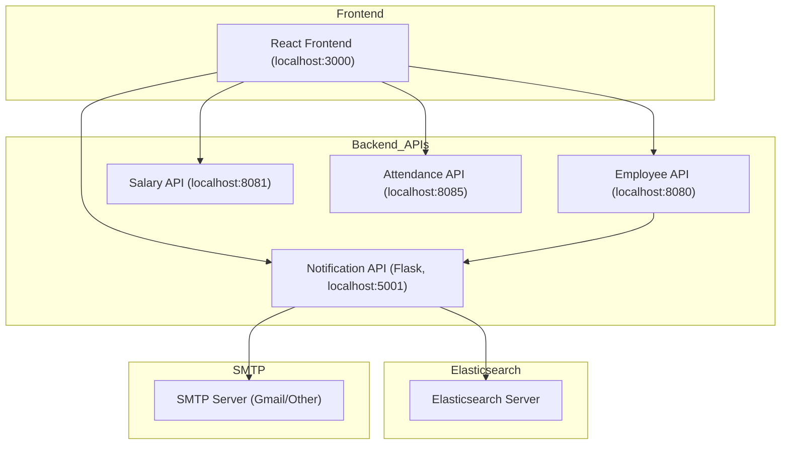
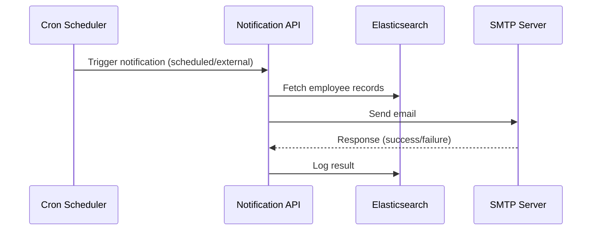

# Notification API - Detailed Documentation

**Repository:** [GitHub – OT-MICROSERVICES/notification-worker](https://github.com/OT-MICROSERVICES/notification-worker)

---

## Author Table

| Author             | Role                   | Created On | Version | Last Updated By | Last Edited On | Reviewer |
| ------------------ | ---------------------- | ---------- | ------- | --------------- | -------------- | -------- |
| **Asma Badr Khan** | Maintainer | 2025-11-10 | 1.2     | Syed Rehan Ali  | 2025-11-10     | Team     |

---

## Purpose

The **Notification API** is a microservice that automates **email notifications** to employees. It retrieves employee records from **Elasticsearch**, sends emails via **SMTP**, and logs notification statuses back into Elasticsearch for tracking and audit.

It integrates with other microservices such as the Employee, Salary, and Attendance APIs within the OT Microservices ecosystem.

---

## Pre-requisites

### System Requirements

| Category         | Minimum          | Recommended        |
| ---------------- | ---------------- | ------------------ |
| Processor        | Dual-core        | 2+ cores           |
| RAM              | 4 GB             | 8 GB+              |
| Disk             | 20 GB            | 50 GB+             |
| Operating System | Ubuntu 22.04 LTS | Any Linux-based OS |

---

### Dependencies

#### Build-time Dependencies

* Git (for cloning the repository)
* Python 3.10 or higher

#### Run-time Dependencies

* Python packages listed in `requirements.txt`
* Valid SMTP credentials (e.g., Gmail app password)
* Running Elasticsearch server with credentials

#### Other Dependencies

* Integration with Employee, Salary, and Attendance APIs
* Optional: Cron scheduler (for scheduled notifications)

---

### Ports

| Direction | Port | Description            |
| --------- | ---- | ---------------------- |
| Inbound   | 5001 | Flask Notification API |
| Outbound  | 587  | SMTP (Gmail/Other)     |
| Outbound  | 9200 | Elasticsearch server   |

---

### Environment Variables

| Variable      | Description                | Example         |
| ------------- | -------------------------- | --------------- |
| `CONFIG_FILE` | Path to configuration YAML | `./config.yaml` |

---

## Architecture

The Notification API interacts with multiple components of the system to ensure message delivery and logging.



---

## Dataflow Diagram



---

## Step-by-Step Setup

### Step 0: Clone the Repository

```bash
git clone https://github.com/OT-MICROSERVICES/notification-worker.git
```

---

### Step 1: Install Python and Dependencies

```bash
sudo apt update
sudo apt install -y python3.10 python3-pip git
cd notification-worker
pip install -r requirements.txt --user
```

---

### Step 2: Configure SMTP & Elasticsearch

Edit config.yaml:

```yaml
smtp:
  from: "rehan.ali9325@gmail.com"
  username: "rehan.ali9325@gmail.com"
  password: "your-app-password"
  smtp_server: "smtp.gmail.com"
  smtp_port: "587"

elasticsearch:
  username: "elastic"
  password: "elastic"
  host: "3.218.208.75"
  port: 9200
```

---

### Step 3: Add Employee Data in Elasticsearch

```bash
curl -X POST "http://3.218.208.75:9200/employee-management/_doc/1" \
-H 'Content-Type: application/json' \
-d '{"email": "user@example.com", "name": "John Doe"}'
```

---

### Step 4: Set Config Environment Variable

```bash
export CONFIG_FILE=./config.yaml
```

---

### Step 5: Run Notification Script

```bash
python3 notification_api.py --mode external
```

---

### Step 6: Optional — Schedule with Cron

```cron
0 * * * * CONFIG_FILE=/path/to/config.yaml /usr/bin/python3 /path/to/notification_api.py --mode external
```

---

## Monitoring & Health

| Metric       | Description                  | Priority | Threshold  |
| ------------ | ---------------------------- | -------- | ---------- |
| Disk Usage   | Disk utilization             | High     | > 90%      |
| CPU Usage    | CPU utilization              | Medium   | > 70%      |
| Memory Usage | RAM consumption              | Medium   | > 80%      |
| Error Rate   | Failed notifications per min | High     | > 5/min    |
| Uptime       | Service availability         | High     | ≥ 99.9%    |
| Throughput   | Emails processed/min         | Medium   | > 1000/min |

---

### Health Probes

| Probe     | Type | Delay | Period | Timeout | Fail Threshold |
| --------- | ---- | ----- | ------ | ------- | -------------- |
| Liveness  | HTTP | 10 s  | 10 s   | 5 s     | 3              |
| Readiness | HTTP | 10 s  | 10 s   | 5 s     | 3              |

---

### Logging

* **Event Logs:** Workflow progress (fetch, send, log)
* **Access Logs:** User trigger, timestamp, mode
* **Server Logs:** Start, stop, and runtime errors
* **Audit Logs:** Email success/failure reports

---

## Disaster Recovery & High Availability

* **High Availability:**
  Deploy multiple instances of Notification API behind a load balancer or Kubernetes replica set.

* **Disaster Recovery:**
  Back up Elasticsearch indices and config files regularly.
  Store SMTP credentials securely (e.g., AWS Secrets Manager).

---

## Troubleshooting

| Issue                     | Symptom                     | Resolution                                                |
| ------------------------- | --------------------------- | --------------------------------------------------------- |
| SMTP Authentication Error | “535 Authentication failed” | Check Gmail app password, enable SMTP access              |
| Elasticsearch Unreachable | Connection error            | Verify host/port and credentials                          |
| No Emails Sent            | No outgoing mail            | Ensure port 587 open and config.yaml correct              |
| Missing Employee Data     | No recipients found         | Verify `employee-management` index and document structure |
| Slow Performance          | Delayed notification        | Check resource usage, scale up container                  |

---

## FAQs

| Question                                                 | Answer / Reference                                                                                                                            |
| -------------------------------------------------------- | --------------------------------------------------------------------------------------------------------------------------------------------- |
| **What does the Notification API do?**                   | It sends automated email alerts to employees using SMTP and logs delivery status to Elasticsearch.                                            |
| **How can I avoid CORS issues when testing with React?** | Use a proxy in React. [React Proxy Setup Docs](https://create-react-app.dev/docs/proxying-api-requests-in-development/)                       |
| **Why use Elasticsearch instead of a SQL database?**     | Elasticsearch provides faster search, scalability, and JSON document flexibility. [Elasticsearch Docs](https://www.elastic.co/elasticsearch/) |
| **How do I create Gmail App Passwords for SMTP?**        | [Google App Password Setup](https://myaccount.google.com/apppasswords)                                                                        |
| **Can I deploy this on AWS or Docker?**                  | Yes — any environment supporting Python 3.10+ and network access to Elasticsearch and SMTP works fine.                                        |
| **Where can I learn about Cron job scheduling?**         | [Crontab Guru Reference](https://crontab.guru/)                                                                                               |

---

## Contact

| Name           | Email                                                     | Role                   |
| -------------- | --------------------------------------------------------- | ---------------------- |
| Asma Badr Khan | [rehan.ali9325@gmail.com](mailto:rehan.ali9325@gmail.com) |Maintainer |

---

## Reference Table

| Reference                   | Description           | Link                                                                                               |
| --------------------------- | --------------------- | -------------------------------------------------------------------------------------------------- |
| Notification API Repo       | Source code           | [GitHub](https://github.com/OT-MICROSERVICES/notification-worker)                                  |
| Elasticsearch Python Client | Official Docs         | [Elastic Docs](https://www.elastic.co/guide/en/elasticsearch/client/python-api/current/index.html) |
| React Proxy Setup           | CORS handling         | [Create React App Docs](https://create-react-app.dev/docs/proxying-api-requests-in-development/)   |
| Cron Jobs                   | Linux task scheduling | [Crontab Guru](https://crontab.guru/)                                                              |
