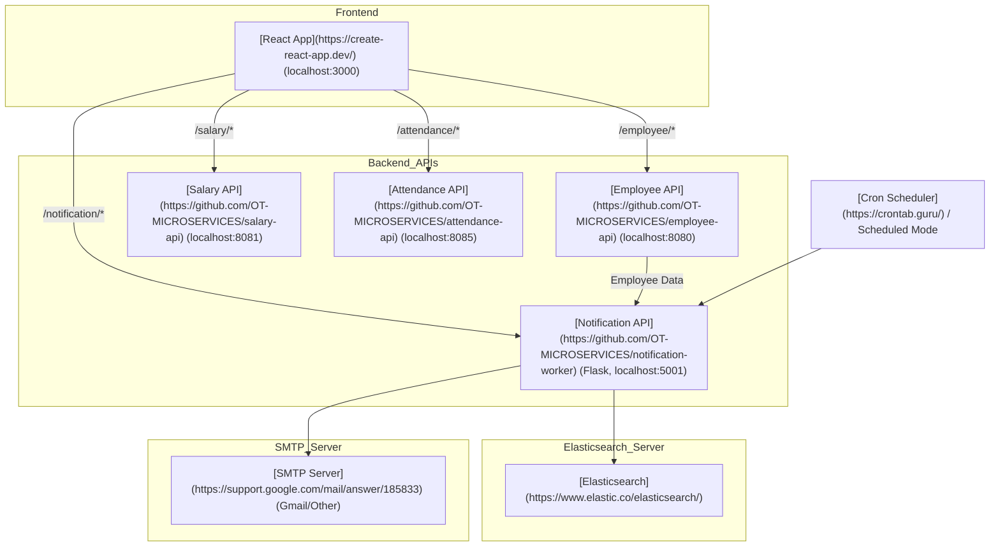
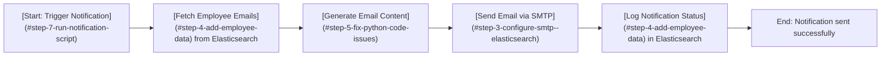

# Notification API Implementation Document


<details>
<summary>Table of Contents</summary>

1. [Overview](#overview)
2. [Authors](#authors)
3. [Prerequisites](#prerequisites)
4. [Step-by-Step Implementation](#step-by-step-implementation)

   * [Step 1: Navigate to Project](#step-1-navigate-to-project)
   * [Step 2: Install Dependencies](#step-2-install-dependencies)
   * [Step 3: Configure SMTP & Elasticsearch](#step-3-configure-smtp--elasticsearch)
   * [Step 4: Add Employee Data](#step-4-add-employee-data)
   * [Why We Are Using Elasticsearch](#why-we-are-using-elasticsearch)
   * [Step 5: Fix Python Code Issues](#step-5-fix-python-code-issues)
   * [Step 6: Set Config Environment Variable](#step-6-set-config-environment-variable)
   * [Step 7: Run Notification Script](#step-7-run-notification-script)
   * [Step 8: Optional Cron Scheduling](#step-8-optional-cron-scheduling)
5. [Frontend Proxy Setup](#frontend-proxy-setup)
6. [Architecture & Workflow](#architecture--workflow)

   * [Architecture Diagram](#architecture-diagram)
   * [Workflow Diagram](#workflow-diagram)
7. [FAQs (External Links)](#faqs-external-links)
8. [Reference Table](#reference-table)

</details>

---

## Overview

This document provides a **Step-by-Step Standard Operating Procedure (SOP)** for the **Notification API**, a microservice designed to send email notifications to employees.

It contains:

* Setup and installation instructions
* SMTP and Elasticsearch configuration
* Steps to add employee data, run scripts, and schedule notifications
* Frontend proxy setup instructions
* Architecture and workflow diagrams
* FAQs and references for further guidance

The SOP is intended for developers, DevOps engineers, and QA teams deploying, testing, or maintaining the Notification API.

**Notification API repository:** [GitHub - Notification Worker](https://github.com/OT-MICROSERVICES/notification-worker)

---

## Author Table

| Author         | Created on | Version | Last updated by | Last Edited On | Reviewer  |
| -------------- | ---------- | ------- | --------------- | -------------- | --------- |
| Syed Rehan Ali | 2025-11-10 | 1.1     | Syed Rehan Ali  | 2025-11-10     | Team   |
| Syed Rehan Ali |  | 1.2     | Syed Rehan Ali  |      |  |
| Syed Rehan Ali |  | 1.2     | Syed Rehan Ali  |     |  |

---

## Prerequisites

* Python 3.10+
* pip3
* Access to Elasticsearch server
* Gmail account or other SMTP credentials

---

## Step-by-Step Implementation

### Step 1: Navigate to Project

`cd ~/OT-MICROSERVICES/notification-worker`

---

### Step 2: Install Dependencies

`pip3 install -r requirements.txt --user`

---

### Step 3: Configure SMTP & Elasticsearch

Edit `config.yaml`:

```yaml
smtp:
  from: "rehan.ali9325@gmail.com"
  username: "rehan.ali9325@gmail.com"
  password: "your-app-password"
  smtp_server: "smtp.gmail.com"
  smtp_port: "587"

elasticsearch:
  username: "elastic"
  password: "elastic"
  host: "3.218.208.75"
  port: 9200
````

---

### Step 4: Add Employee Data

```bash
curl -X POST "http://3.218.208.75:9200/employee-management/_doc/1" \
-H 'Content-Type: application/json' \
-d '{"email": "user@example.com","name": "John Doe"}'
```

---

### Why We Are Using Elasticsearch

Elasticsearch is used in the Notification API to efficiently **store, search, and retrieve employee data** and **log notification statuses**. Its advantages include:

* **Fast Search & Retrieval:** Quickly fetch employee emails and related metadata for notifications.
* **Scalable Storage:** Handle a growing number of employee records without performance degradation.
* **Structured Logging:** Log notification success/failure for auditing and troubleshooting.
* **Integration Friendly:** Seamlessly integrates with Python and other microservices in the system.

By using Elasticsearch, the Notification API ensures that notifications are sent accurately and logged efficiently for future reference.

---

### Step 5: Fix Python Code Issues

Ensure correct config reads and email sending logic. Run:

```bash
python3 notification_api.py --mode scheduled
python3 notification_api.py --mode external
```

---

### Step 6: Set Config Environment Variable

```bash
export CONFIG_FILE=./config.yaml
```

---

### Step 7: Run Notification Script

```bash
python3 notification_api.py --mode external
```

---

### Step 8: Optional Cron Scheduling

```cron
0 * * * * CONFIG_FILE=/path/to/config.yaml /usr/bin/python3 /path/to/notification_api.py --mode external
```

---

## Frontend Proxy Setup

```javascript
const { createProxyMiddleware } = require('http-proxy-middleware');

module.exports = function(app) {
  app.use('/employee', createProxyMiddleware({ target: 'http://localhost:8080', changeOrigin: true }));
  app.use('/salary', createProxyMiddleware({ target: 'http://localhost:8081', changeOrigin: true }));
  app.use('/attendance', createProxyMiddleware({ target: 'http://localhost:8085', changeOrigin: true }));
  app.use('/notification', createProxyMiddleware({ target: 'http://localhost:5001', changeOrigin: true }));
};
```

---

## Architecture & Workflow

### Architecture Diagram



### Workflow Diagram



---

## FAQs

* [Why use a proxy in React?](https://create-react-app.dev/docs/proxying-api-requests-in-development/)
* [CORS explanation](https://developer.mozilla.org/en-US/docs/Web/HTTP/CORS)
* [Elasticsearch integration with Python](https://www.elastic.co/guide/en/elasticsearch/client/python-api/current/index.html)

---

## Reference Table

| Reference                   | Description                            | Link                                                                                               |
| --------------------------- | -------------------------------------- | -------------------------------------------------------------------------------------------------- |
| Notification API Repo       | Source code and main repo              | [GitHub](https://github.com/OT-MICROSERVICES/notification-worker)                                  |
| Gmail App Passwords         | How to generate app passwords for SMTP | [Google Account](https://myaccount.google.com/apppasswords)                                        |
| Elasticsearch Python Client | Official Python client documentation   | [Elastic Docs](https://www.elastic.co/guide/en/elasticsearch/client/python-api/current/index.html) |
| React Proxy Setup           | Avoiding CORS in development           | [Create React App Docs](https://create-react-app.dev/docs/proxying-api-requests-in-development/)   |
| Cron Jobs                   | Scheduling scripts in Linux            | [Cron Tutorial](https://crontab.guru/)                                                             |
