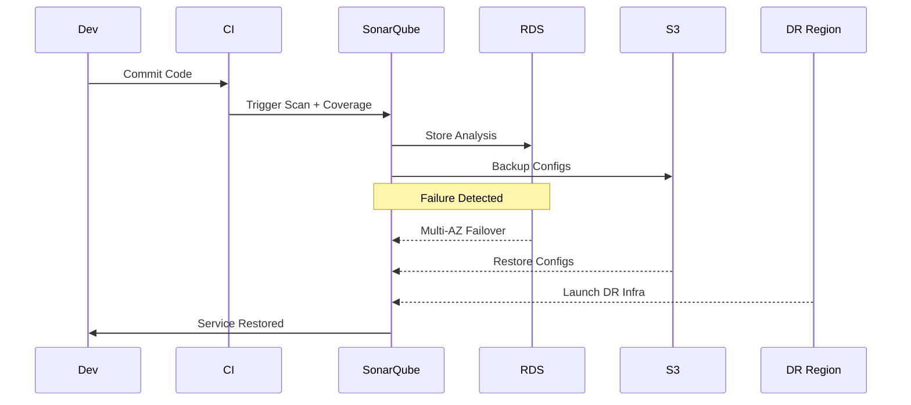

# SonarQube DR Runbook

This document contains **step-by-step Disaster Recovery (DR) procedures** for SonarQube hosted on AWS. It is intended for operational use by on-call engineers to restore services quickly in case of failure.  

---

## **A. EC2 Failure Recovery**

### Symptoms

* SonarQube UI unreachable
* EC2 instance health check failed

### Steps

1. Check ASG activity:

```bash
AWS Console → EC2 → Auto Scaling Groups
````

2. If instance failed → ASG launches new instance automatically.
3. Validate logs:

```bash
/opt/sonarqube/logs/sonar.log
```

4. Confirm configs restored from S3.
5. Verify UI accessibility.

### MTTR: **5–10 minutes**

---

## **B. RDS Multi-AZ Failover**

### Symptoms

* “Database not reachable” error in SonarQube
* Increased latency or failed scans

### Steps

1. Check failover events:

```bash
AWS Console → RDS → Events
```

2. Confirm new primary DB is assigned.
3. Validate SonarQube automatically reconnects.

### MTTR: **3–7 minutes**

---

## **C. RDS Database Corruption (PITR)**

### Symptoms

* Wrong metrics or missing results
* Duplicate scan analysis

### Steps

1. Identify last known good timestamp.
2. Restore DB using PITR:

```bash
RDS → Actions → Restore to Point In Time
```

3. Update JDBC URL in `sonar.properties`:

```bash
sonar.jdbc.url=jdbc:postgresql://<new-endpoint>:5432/sonar
```

4. Restart SonarQube service.

### MTTR: **25–40 minutes**

---

## **D. Config/Plugin Corruption**

### Symptoms

* SonarQube fails to start
* Plugin errors
* Missing UI features

### Steps

1. Recover configuration and plugins from S3:

```bash
aws s3 sync s3://sonarqube-backup/conf /opt/sonarqube/conf
aws s3 sync s3://sonarqube-backup/plugins /opt/sonarqube/extensions/plugins
```

2. Restart service:

```bash
systemctl restart sonarqube
```

### MTTR: **5–10 minutes**

---

## **E. Full Region Outage**

### Steps

1. Promote cross-region RDS read replica.
2. Launch EC2 from AMI in DR region.
3. Restore configs/plugins from DR S3 bucket.
4. Update Route 53 failover policy.
5. Validate SonarQube service restoration.

### MTTR: **30–60 minutes**

---

## **Diagrams**

### DR Workflow (End-to-End)


