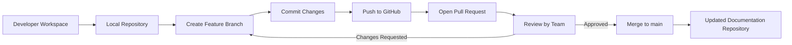

# **Version Control System (VCS) Setup**

## Author table

| **Author**     | **Created** | **Version** | **Last updated by** | **Last Edited On** | **Pre Review** | **L0 Reviewer** | **L1 Reviewer** | **L2 Reviewer** |
| -------------- | ----------- | ----------- | ------------------- | ------------------ | -------------- | --------------- | --------------- | --------------- |
| Asma Badr Khan | 2025-12-1   | 1.0         | Asma Badr Khan      | 2025-12-1          |                |                 |                 |                 |

---

## **Table of Contents**

1. [Introduction](#introduction)
2. [Objective](#1-objective)
3. [Repository Overview](#2-repository-overview)
4. [Branching Strategy](#3-branching-strategy)
5. [VCS Workflow — Implementation Steps](#4-vcs-workflow--implementation-steps)
6. [Pull Request / Review Workflow](#5-pull-request--review-workflow)
7. [Branch Protection / Access Rules](#6-branch-protection--access-rules)
8. [Checklist](#7-checklist)
9. [Diagram: Downtime Rakshak VCS Workflow](#8-diagram-downtime-rakshak-vcs-workflow)
10. [Implementation Verification](#9-implementation-verification)
11. [Conclusion](#10-conclusion)
12. [Recommendations](#11-recommendations)
13. [Contact Information](#12-contact-information)
14. [References](#13-references)

---

## **1.Introduction:**
Version Control Systems (VCS) are essential for managing changes to project files over time, enabling team collaboration and tracking history. Git is a distributed VCS used for versioning code, supporting branching, merging, and local history. GitHub is a cloud platform for hosting Git repositories, providing collaboration tools like pull requests, code reviews, and branch protection to ensure a stable codebase.

---

## **2. Objective**

| Goal      | Description                                                            |
| --------- | ---------------------------------------------------------------------- |
| Setup VCS | Implement Git + GitHub for Snaatak Downtime Rakshak Documentation repo |
| Purpose   | Track changes, collaborate safely, and manage project history          |
| Audience  | Developers, team leads, reviewers                                      |

---

## **3. Repository Overview**

| Attribute        | Value                                                                 |
| ---------------- | --------------------------------------------------------------------- |
| Repository Name  | `Documentation`                                                       |
| Remote URL       | `https://github.com/Snaatak-Downtime-Rakshak/Documentation`           |
| Default Branch   | `main` (Protected)                                                    |
| Task Branches    | `SCRUM-<ID>-<Developer>`                                              |
| Folder Structure | `Architecture/`, `API-Docs/`, `Requirements/`, `Images/`, `README.md` |

---

## **4. Branching Strategy**

| Branch Type    | Example                     | Purpose                             |
| -------------- | --------------------------- | ----------------------------------- |
| Main           | `main`                      | Stable, protected branch            |
| Feature / Task | `SCRUM-684-asma`            | Development branch per task/Jira ID |
| Hotfix         | `hotfix-<ID>`               | Quick fixes                         |
| Guidelines     | Delete branches after merge | Keep repository clean               |

---

## **5. VCS Workflow — Implementation Steps**

| Step                  | Command / Action                                                      | Notes / Purpose                 |
| --------------------- | --------------------------------------------------------------------- | ------------------------------- |
| Clone repository      | `git clone git@github.com:Snaatak-Downtime-Rakshak/Documentation.git` | Setup local copy                |
| Check main branch     | `git checkout main`                                                   | Ensure branch protection active |
| Create feature branch | `git checkout -b SCRUM-684-asma`                                      | Start task-specific branch      |
| Stage changes         | `git add <file>`                                                      | Prepare files for commit        |
| Commit changes        | `git commit -m "SCRUM-684: Initial VCS setup"`                        | Record changes locally          |
| Push branch           | `git push --set-upstream origin SCRUM-684-asma`                       | Upload branch to GitHub         |
| Open Pull Request     | GitHub UI                                                             | Request review from team        |
| Reviewer Approval     | GitHub PR review                                                      | Validate changes                |
| Merge to main         | GitHub UI                                                             | Apply changes to stable branch  |
| Delete branch         | GitHub UI                                                             | Optional cleanup                |

---

## **6. Pull Request / Review Workflow**

| Step      | Action                               |
| --------- | ------------------------------------ |
| Create PR | Include Jira ID & description        |
| Review    | Assigned reviewer validates changes  |
| Approval  | PR approved by reviewer              |
| Merge     | Merge into `main` branch             |
| Verify    | Confirm main branch reflects changes |

---

## **7. Branch Protection / Access Rules**

| Rule                     | Purpose                         |
| ------------------------ | ------------------------------- |
| Protected Default Branch | Prevent direct commits          |
| Require PR Approval      | Ensure quality & accountability |
| No Force Push            | Protect branch history          |
| Optional CI/CD Checks    | For future automated validation |

---

## **8. Checklist**

| Step                                   | Action |
| -------------------------------------- | ------ |
| Clone repo locally                     | ✅      |
| Switch to main branch                  | ✅      |
| Create SCRUM feature branch            | ✅      |
| Make a sample change (e.g., README.md) | ✅      |
| Stage & commit changes                 | ✅      |
| Push branch to GitHub                  | ✅      |
| Open PR & assign reviewer              | ✅      |
| Reviewer approves PR                   | ✅      |
| Merge branch to main                   | ✅      |
| Delete branch (optional)               | ✅      |
| Show main branch reflects changes      | ✅      |

---

## **9. Diagram: Downtime Rakshak VCS Workflow**

---

## **10. Implementation Verification**

| Feature                         | Status |
| ------------------------------- | ------ |
| Repository cloned successfully  | ✅      |
| SCRUM-based branch creation     | ✅      |
| Push & PR workflow              | ✅      |
| Main branch protection enforced | ✅      |
| Merge after approval works      | ✅      |
| Demo checklist verified         | ✅      |

---

## **11. Conclusion**

The VCS setup ensures safe and organized version control for the project.

Branching strategy (main + feature/task branches) allows parallel development without conflicts.

Pull Request workflow enforces code review, quality, and accountability.

Branch protection prevents accidental changes to the main branch, maintaining a stable codebase.

Demo checklist verifies the end-to-end VCS workflow is functional, from local changes to merge on main.

Overall, the setup supports team collaboration, traceability, and reproducible history, enabling smooth project development.

---

## **12. Recommendations**

| Recommendation             | Purpose                           |
| -------------------------- | --------------------------------- |
| Follow SCRUM branch naming | Task traceability                 |
| Keep PRs small & focused   | Faster review & merge             |
| Use PR template            | Consistency                       |
| Maintain branch protection | Prevent accidental changes        |
| Use demo checklist         | Show workflow clearly to reviewer |

---

## **13. Contact Information**

| Name        | Role                  | Email                                                   |
| ----------- | --------------------- | ------------------------------------------------------- |
| <Your Name> | Developer / Team Lead | [your.email@example.com](mailto:your.email@example.com) |

---

## **14. References**

| Reference Topic              | Link                                                                                                                 |
| ---------------------------- | -------------------------------------------------------------------------------------------------------------------- |
| GitHub Documentation         | [https://docs.github.com](https://docs.github.com)                                                                   |
| Git Basics Guide             | [https://git-scm.com/book/en/v2](https://git-scm.com/book/en/v2)                                                     |
| Branching Strategy Reference | [https://nvie.com/posts/a-successful-git-branching-model/](https://nvie.com/posts/a-successful-git-branching-model/) |
