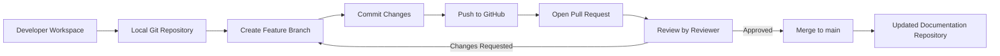
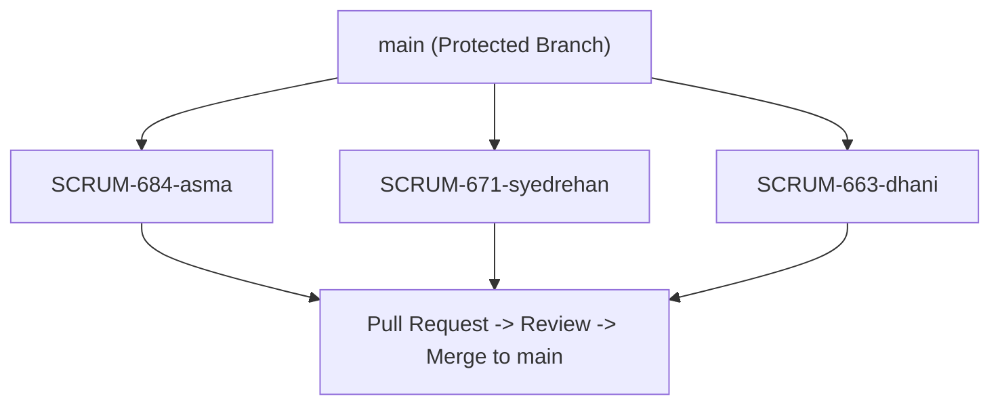

# 📘 **GitHub VCS Setup & Workflow — Documentation**

---

## **Author Table**

| Author      | Created On | Version | Last Updated By | Last Edited On | Pre Review | L0 Reviewer | L1 Reviewer | L2 Reviewer |
| ----------- | ---------- | ------- | --------------- | -------------- | ---------- | ----------- | ----------- | ----------- |
| *Your Name* | 2025-12-01 | 1.1     | *Your Name*     | 2025-12-01     |            |             |             |             |

---

## **Table of Contents**

1. Introduction
2. Version Control System (VCS) Overview
3. Why GitHub
4. Repository Structure
5. Branching Strategy
6. Git Workflow
7. Branch Protection Rules
8. Pull Request Workflow
9. Access Management
10. Tools Used
11. Advantages
12. Best Practices
13. Conclusion
14. Recommendations
15. POC Overview
16. Mermaid Diagrams
17. Contact Information
18. References

---

## **1. Introduction**

This document provides a **complete guide for GitHub VCS setup** for the *Snaatak Downtime Rakshak Documentation Repository*, including branch strategy, workflow, PR review, access control, and best practices.

---

## **2. Version Control System (VCS) Overview**

| Feature      | Description                                        |
| ------------ | -------------------------------------------------- |
| Definition   | Tracks changes to files over time                  |
| Main Purpose | Collaboration, version history, branching, merging |
| Tools        | Git, GitHub                                        |

---

## **3. Why GitHub**

| Benefit       | Description                                   |
| ------------- | --------------------------------------------- |
| Collaboration | Multiple developers can work simultaneously   |
| Branching     | Separate task/feature development             |
| Pull Requests | Review & approval process                     |
| Protection    | Protected branches prevent accidental changes |
| CI/CD         | Optional integration for validation           |
| Security      | Access control & audit history                |

---

## **4. Repository Structure**

| Folder/File     | Description                     |
| --------------- | ------------------------------- |
| `Architecture/` | Architecture diagrams & info    |
| `API-Docs/`     | API documentation               |
| `Requirements/` | Requirements & specifications   |
| `VCS-Setup.md`  | This document                   |
| `README.md`     | Overview of the repo            |
| `.github/`      | Templates, workflows (optional) |
| `Images/`       | Supporting images               |

---

## **5. Branching Strategy**

| Branch Type  | Name Example     | Purpose                         |
| ------------ | ---------------- | ------------------------------- |
| Main         | `main`           | Protected, stable branch        |
| Feature/Task | `SCRUM-684-asma` | Developer work, tied to Jira ID |

---

## **6. Git Workflow**

| Step           | Command / Action                                | Description                  |
| -------------- | ----------------------------------------------- | ---------------------------- |
| Clone repo     | `git clone git@github.com:repo.git`             | Copy repository locally      |
| Create branch  | `git checkout -b SCRUM-684-asma`                | Start new task/feature       |
| Stage changes  | `git add .`                                     | Add changes to commit        |
| Commit changes | `git commit -m "SCRUM-684: Update docs"`        | Save changes locally         |
| Push branch    | `git push --set-upstream origin SCRUM-684-asma` | Upload branch to GitHub      |
| Create PR      | GitHub UI                                       | Open pull request for review |
| Merge          | After approval                                  | Merge changes to main        |

---

## **7. Branch Protection Rules**

| Rule              | Description                        |
| ----------------- | ---------------------------------- |
| PR required       | No direct commits to main          |
| Reviewer required | At least one reviewer must approve |
| No force pushes   | Protects main branch history       |
| Status checks     | Pass required before merge         |
| Branch deletion   | Disabled for main                  |

---

## **8. Pull Request Workflow**

| Step             | Description                           |
| ---------------- | ------------------------------------- |
| Create PR        | Include Jira ID & description         |
| Automated checks | Optional validations                  |
| Review           | Reviewer approves or requests changes |
| Merge            | Merge after approval                  |
| Delete branch    | Remove feature branch after merge     |

---

## **9. Access Management**

| Role       | Permission                   |
| ---------- | ---------------------------- |
| Admin      | Full repository access       |
| Maintainer | Merge PRs, manage branches   |
| Developer  | Push to branches, create PRs |
| Viewer     | Read-only                    |

---

## **10. Tools Used**

| Purpose        | Tool          |
| -------------- | ------------- |
| VCS            | Git           |
| Remote Repo    | GitHub        |
| Task Tracking  | Jira          |
| Review Process | Pull Requests |

---

## **11. Advantages**

| Advantage          | Description                               |
| ------------------ | ----------------------------------------- |
| Safe Collaboration | Multiple developers without conflicts     |
| Branch Isolation   | Work independently without affecting main |
| PR Review Cycle    | Ensures quality & correctness             |
| Full History       | Track all changes over time               |
| Access Control     | Secure & audit-friendly                   |

---

## **12. Best Practices**

| Practice                | Description                           |
| ----------------------- | ------------------------------------- |
| Jira-based branch names | Use `SCRUM-xxx-name` for traceability |
| Always use PRs          | Avoid direct commits                  |
| Keep PRs small          | Easier review & merge                 |
| Delete merged branches  | Keeps repo clean                      |
| Follow folder structure | Organized repository                  |
| Use meaningful commits  | Clear version history                 |
| PR template             | Consistency in submissions            |

---

## **13. Conclusion**

GitHub is a **robust, secure, and traceable VCS** for documentation projects.
Using protected branches, PR workflow, and best practices ensures:

* High-quality documentation
* Smooth collaboration
* Traceable changes
* Safe merging

---

## **14. Recommendations**

| Recommendation                | Description                 |
| ----------------------------- | --------------------------- |
| Enforce PR template           | Ensure all PRs are complete |
| Strict branch protection      | Prevent accidental merges   |
| Small PRs                     | Faster review & merge       |
| Mandatory reviewer assignment | Avoid mistakes              |
| Maintain folder structure     | Keep repository organized   |
| Clean merged branches         | Reduce clutter              |

---

## **15. POC Overview**

| Feature Tested              | Outcome    |
| --------------------------- | ---------- |
| SCRUM-based branch creation | ✅ Works    |
| Push & PR flow              | ✅ Works    |
| Branch protection           | ✅ Enforced |
| Merge after approval        | ✅ Works    |

---

## **16. Mermaid Diagrams**

### A. GitHub Workflow Diagram

### B. Branching Strategy Diagram

---

## **17. Contact Information**

| Name        | Email                                                         |
| ----------- | ------------------------------------------------------------- |
| *Your Name* | [your.email@mygurukulam.co](mailto:your.email@mygurukulam.co) |

---

## **18. References**

| Topic                   | Link                                                                                                                                                                                     |
| ----------------------- | ---------------------------------------------------------------------------------------------------------------------------------------------------------------------------------------- |
| Git Documentation       | [https://git-scm.com/docs](https://git-scm.com/docs)                                                                                                                                     |
| GitHub PR Guide         | [https://docs.github.com/en/pull-requests](https://docs.github.com/en/pull-requests)                                                                                                     |
| Branch Protection Rules | [https://docs.github.com/en/repositories/configuring-branches-and-merges-in-your-repository](https://docs.github.com/en/repositories/configuring-branches-and-merges-in-your-repository) |
